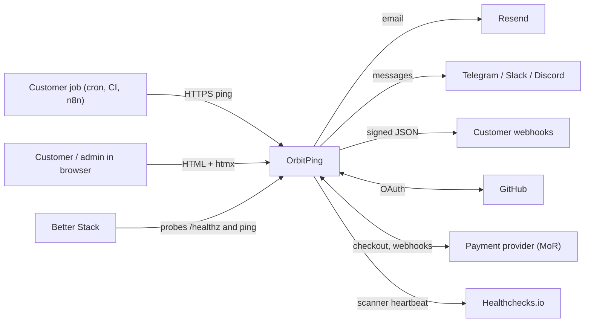
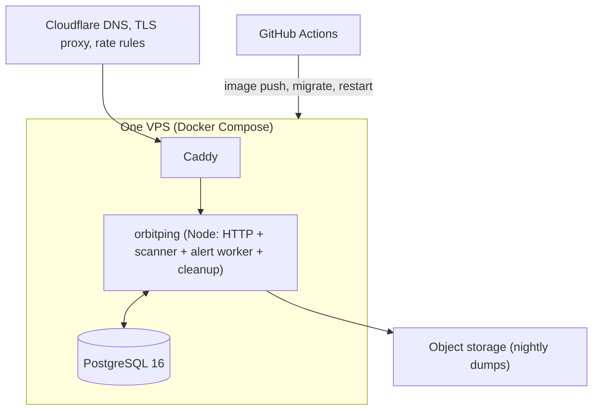
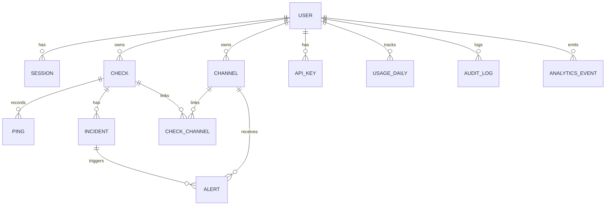
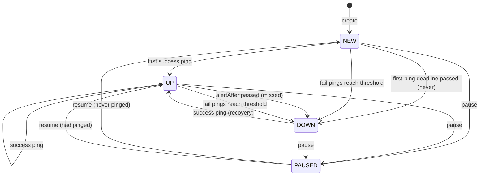
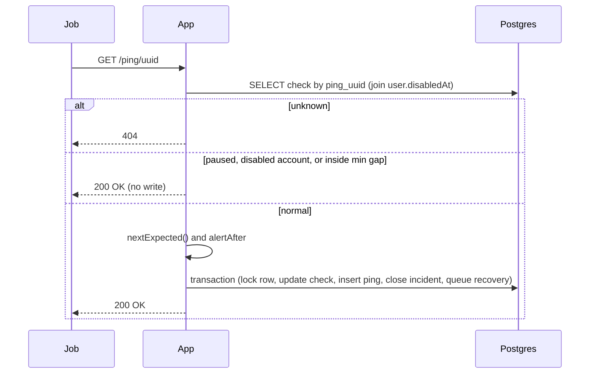
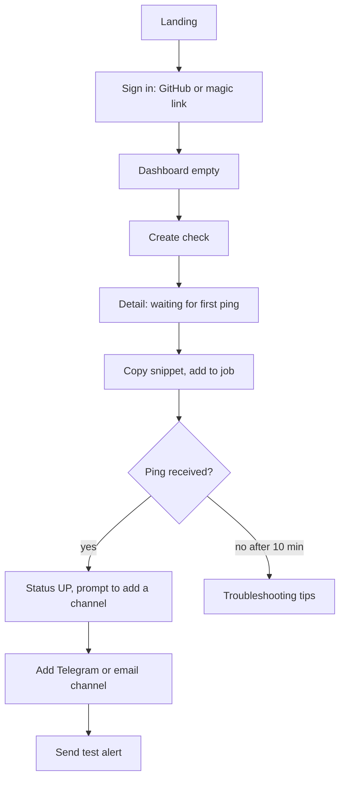
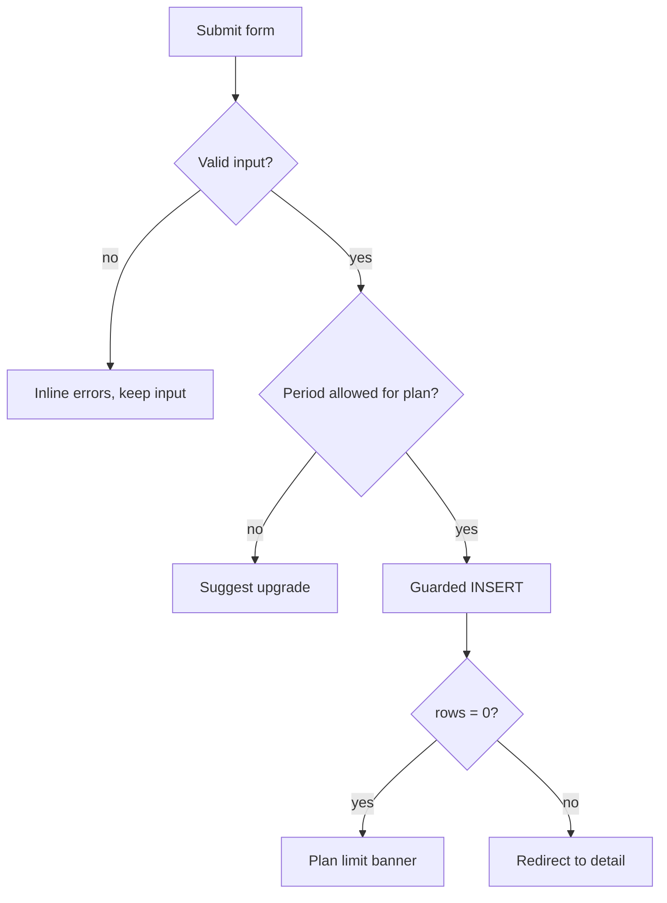
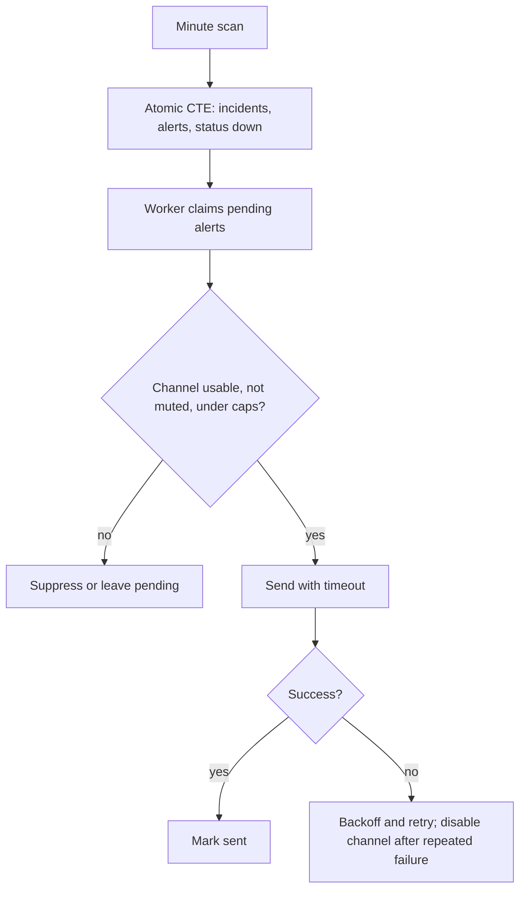
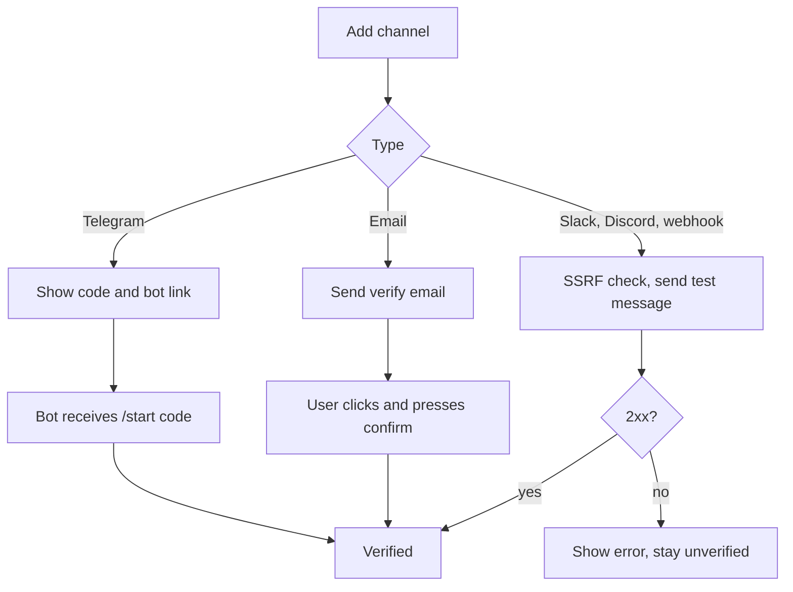
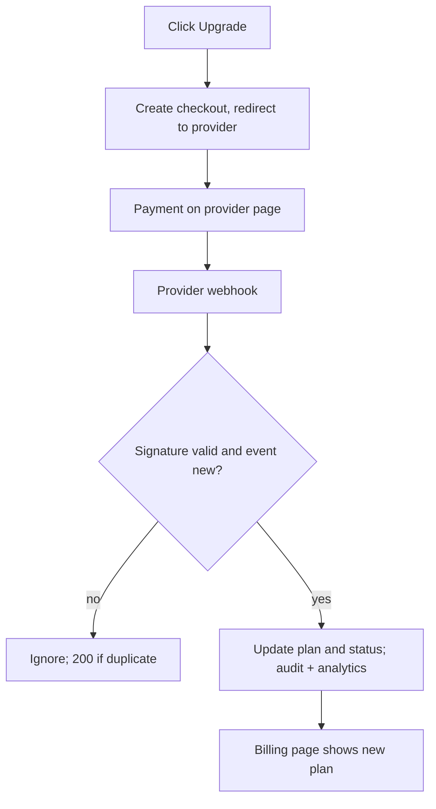

# OrbitPing: Final Project Documentation

Version 4.0 · 29 Sep 2026 · Supersedes Cronping v1, v2, v3.
Product name: **OrbitPing** (renamed from Cronping). Stack: **TypeScript, Node.js, Prisma, PostgreSQL**.

**Purpose of this document.** It is the comprehensive technical specification and architectural blueprint for OrbitPing, defining all system behaviors, protocols, schemas, and operational requirements. Where a value is marked `[VERIFY]`, it denotes an external integration parameter to check against upstream provider documentation. All architectural modules are verified against active implementations.

## Contents
1 Product · 2 Plans, pricing, billing rules · 3 Tech stack · 4 Directory structure · 5 Configuration · 6 Architecture · 7 Database (Prisma) · 8 API and routes · 9 Detailed design · 10 Alert controls · 11 UI design and wireframes · 12 Message previews · 13 User and system flows · 14 Written content · 15 Legal drafts · 16 Data collected and privacy · 17 Security · 18 Admin console · 19 Analytics and success metrics · 20 Business math · 21 Setup guides · 22 Testing, CI/CD, operations · 23 Runbooks · 24 Risks · 25 Decision log, open questions, module dependencies · Appendix A (CLI script) · Appendix B (Docker and Caddy)

---

# 1. Product

## 1.1 The problem it solves
Scheduled jobs fail silently and nobody finds out until the damage is done. Cron, systemd timers, wp-cron, GitHub Actions schedules, Laravel/Django schedulers, n8n and Make only *start* jobs. They do not say "this job never ran", "this job hung" or "this job failed". Cron has no built-in way to report absence. Server and uptime monitors do not help because the server is fine while the job has quietly stopped.

| What goes wrong | Why nobody notices | Real cost |
|---|---|---|
| Nightly backup stops after a server change, full disk or expired password | No error is shown anywhere | Found only at restore time, when the last backup is months old |
| Invoicing or billing run skips a day | No customer complains at once | Late or lost revenue |
| Scraper or data sync dies | Dashboards show stale data | Decisions made on old data |
| GitHub Actions schedule is skipped or delayed | Failures are not pushed to anyone | Missed deploys, reports, cleanups |
| wp-cron stops on a client site | Scheduled posts, emails, renewals stop | Agency hears about it from the client |
| Job set up wrong and never ran once | No failure exists, only silence | Weeks of nothing |
| Server rebuilt or deploy overwrote crontab | Job simply vanishes | Silent outage of everything scheduled |
| Job hangs and never finishes | Process looks alive | Blocked pipelines, stale output |
| DST or timezone change shifts the run | Runs at the wrong hour or twice | Wrong data, duplicate sends |

Why current options fall short:

| Approach | Gap |
|---|---|
| Cron MAILTO, logs, email-on-error | Only speak when the job ran and complained. A job that never ran produces nothing |
| Server or uptime monitoring | Proves the machine or site is up, not that a specific job ran |
| Error trackers (Sentry etc.) | Only see errors from code that executed. Blind to "did not run" |
| Manual checking | Does not scale, gets forgotten |
| Heartbeat tools (Healthchecks.io, Cronitor) | Exist and work, but per-monitor pricing hurts agencies and adding monitoring to existing crontabs is manual |

**OrbitPing's answer.** Invert the check. The job reports in when it finishes (a "dead man's switch" or heartbeat). If the report is missing, late, says it failed, or the job was set up and never reported at all, the owner is alerted in Telegram, Slack, Discord, email or a webhook, and told again when it recovers. Setup takes about two minutes and one line in the crontab.

**Who feels it most:** solo developers, small agencies, freelancers and sysadmins who run several jobs on servers they do not watch daily and cannot afford enterprise monitoring.

## 1.2 What it is (one paragraph)
OrbitPing is a heartbeat monitor for scheduled jobs. Each job ("check") gets a unique secret ping URL. The job calls it when it finishes (optionally also when it starts). If no ping arrives by the expected time plus a grace period, or the job reports failure, or a new check never pings within its first-ping deadline, OrbitPing opens an incident, alerts the owner on their chosen channels, and sends a recovery message when the job reports success again. OrbitPing only monitors; it never runs or schedules the customer's jobs.

## 1.3 How detection works (plain words)
1. You create a check and tell OrbitPing how often the job should run (for example "every day at 02:00, Asia/Kolkata") and how much lateness you tolerate (grace, for example 15 minutes).
2. OrbitPing gives you a URL. You add one line to the end of your job that requests that URL.
3. Every successful request tells OrbitPing "alive". OrbitPing computes the next time it expects a ping, adds the grace, and stores that as the deadline (`alertAfter`).
4. Every minute a scanner looks for checks whose deadline has passed. Each one becomes an incident and triggers alerts once.
5. If the job later pings successfully, the incident closes and a recovery alert goes out.
6. A job can also send `/start` before it runs (so OrbitPing measures duration), `/fail` or `/<exit-code>` when it breaks (so you get alerted immediately instead of waiting for the deadline).

**Where to put the ping line so a broken job never reports success.**
- Wrong: `./backup.sh; curl https://ping.orbitping.example/UUID` (curl runs even if backup failed).
- Right: `./backup.sh && curl -fsS -m 10 --retry 3 https://ping.orbitping.example/UUID`
- Best: `orbitping run UUID -- ./backup.sh` (sends start, runs the command, sends the exit code, never changes the command's own exit status).
- Put the ping as the **last** statement of the job, after the real work. Never put it at the top for a success signal.
- In GitHub Actions put the ping in a final step using `if: success()`, and a failure ping in a step using `if: failure()`.
- The ping must not break the job: use `-fsS -m 10 --retry 3`, and never `set -e` around it without `|| true` if the ping must not fail the job.

**What "down" means.** Three reasons exist: `MISSED` (was up, deadline passed), `NEVER` (new check never pinged before its first-ping deadline), `FAIL` (job explicitly reported failure, subject to the check's fail threshold).

## 1.4 Users and jobs to be done

| Persona | Job to be done |
|---|---|
| Solo developer | "Tell me if my nightly backup or scraper silently stopped" |
| Small agency / freelancer | "Watch many clients' wp-cron, invoicing and report jobs from one place" |
| Sysadmin | "Add monitoring to existing crontabs with one line" |
| Automation builder (n8n, Make, GitHub Actions) | "Know when a scheduled workflow was skipped" |
| Product owner (admin, the founder) | "See users, plans, health, abuse and metrics without touching the database" |

## 1.5 Wedge (why OrbitPing over Healthchecks.io or Cronitor)
Two-minute setup with first ping visible live; `orbitping run` wrapper and installer in release 1; Telegram-first alerts verified in seconds; flat, predictable pricing; agency-friendly limits.

## 1.6 Glossary
- **Check**: one monitored job. **Ping URL**: its secret URL (UUIDv4). **Period**: expected interval in seconds. **Cron schedule**: cron expression plus IANA timezone.
- **Grace**: extra time allowed before alerting. **Alert-after (`alertAfter`)**: stored deadline = next expected + grace.
- **Status**: `NEW` (never pinged), `UP`, `DOWN`, `PAUSED`. **Late** is display-only (past expected, inside grace).
- **Incident**: one down episode of one check. **Channel**: an alert destination. **Alert**: one message to one channel about one incident event (`DOWN`, `RECOVERED`, `REMINDER`).
- **Run ID (`rid`)**: optional id linking a start ping to its finish ping. **Min gap**: minimum seconds between recorded success pings.
- **Fail threshold**: number of consecutive fail pings before an incident opens. **Mute**: temporary suppression of alerts for a check.
- **Merchant of record (MoR)**: payment provider that sells to the customer on your behalf and handles tax, invoices, refunds, chargebacks.

## 1.7 Scope
**Release 1 (must ship).**

| # | Feature | Acceptance criteria |
|---|---|---|
| 1 | Sign-in with GitHub and email magic link | New user reaches dashboard in under 30 s; no passwords |
| 2 | Check CRUD, pause, resume, clone | Invalid cron/timezone rejected with a readable message; plain-English schedule and next 5 expected times shown |
| 3 | Ping endpoint (success, start, fail, exit code, rid, msg) | 200 OK; unknown UUID 404; retries safe; no writes inside min gap |
| 4 | Missed-ping and never-pinged detection every minute | Overdue check goes down and alerts exactly once |
| 5 | Channels: email, Telegram, Slack, Discord, webhook, recovery notices | Verified before use; "Send test alert" works; no duplicate alerts |
| 6 | Dashboard and check detail | Live status list, recent pings, incident history, search and filter |
| 7 | Snippets | curl, crontab, bash, Python, Node, PHP, PowerShell, GitHub Actions, wp-cron, systemd, Docker, with copy buttons |
| 8 | `orbitping run` CLI wrapper and installer | Wraps command; sends start, exit code, last 256 bytes of output on failure |
| 9 | Plans and billing with a merchant of record | Server-side limit enforcement; webhook idempotency; downgrade never deletes data |
| 10 | Alert controls: fail threshold, mute check, tags-free filters | Fail threshold 1 to 5; mute for 1 h to 30 days |
| 11 | Admin console | Users list, plan override, disable account, metrics, audit log (section 18) |
| 12 | Static pages | Landing, pricing, docs, terms, privacy, refund, status, 404, 500 |
| 13 | Self-monitoring and outage compensation | External watchers, synthetic end-to-end alert test, no false alerts after own downtime |
| 14 | Account | Export data, delete account, sign out everywhere |
| 15 | Product analytics (server-side, cookie-free) | Signup, first-ping, activation, upgrade events recorded |

**Release 2.** Public JSON API and API keys, runtime-too-long alerts, reminder alerts (Plus), quiet hours, daily aggregates and uptime %, tags, status badges, per-check slugs, Go CLI binary, weekly digest email, CSV import of checks.
**Release 3 (only on paying-customer demand).** Teams and shared workspaces, public per-customer status pages, HTTP uptime checks, SMS, SSO, Pushover/PagerDuty/Opsgenie, ingest edge queue on Cloudflare Workers.

## 1.8 Non-goals for release 1
Uptime (HTTP) checks, customer status pages, teams, SMS, mobile app, AI features, log storage, executing or scheduling customer jobs, impersonating users from admin, a hardcoded admin username and password.

---

# 2. Plans, pricing, billing rules

## 2.1 Final plan table (single source of truth is `src/config/plans.ts`; this table must match it)

| | Free | Pro | Plus |
|---|---|---|---|
| Monthly price | $0 | $9 | $19 |
| Yearly price (2 months free) | n/a | $90 | $190 |
| Checks | 10 | 50 | 200 |
| Shortest period / cron granularity | 15 min | 1 min | 1 min |
| Ping history kept per check | 20 | 100 | 100 |
| Incident history kept | 30 days | 90 days | 180 days |
| Alert channels | 3 | 10 | 25 |
| Min gap between recorded success pings | 300 s | 10 s | 10 s |
| Emails per day per user | 30 | 200 | 500 |
| Fail threshold, mute | yes | yes | yes |
| Reminder alerts (repeat while down) | no | no | yes (release 2) |
| Quiet hours | no | yes (release 2) | yes (release 2) |
| JSON API | no | yes (release 2) | yes (release 2) |
| Support | best effort, email | email, 1 business day | email, 1 business day, priority |

Free is best effort; paid states "target 99.5% availability" until real numbers are measured. Founding members (first 50 paying users) get a permanent 30% discount, not free service. Prices are in USD; the MoR shows local currency and tax at checkout.

## 2.2 Subscription rules (all decisions)
- **Trials:** none. The Free plan is the trial. A 14-day money-back window (refund policy) replaces a card-required trial.
- **Billing periods:** monthly and yearly for both Pro and Plus. Four provider products/prices: `PRO_MONTHLY`, `PRO_YEARLY`, `PLUS_MONTHLY`, `PLUS_YEARLY`.
- **Upgrade (Pro to Plus, or monthly to yearly):** effective immediately; the provider prorates. Limits rise as soon as the webhook is applied.
- **Downgrade (Plus to Pro, Pro to Free, yearly to monthly):** takes effect at the end of the paid period. Until then the user keeps current limits.
- **Cancel:** subscription stays active until `planRenewsAt`, then plan becomes `FREE`, `planStatus` becomes `NONE`.
- **Failed payment:** `planStatus = PAST_DUE`. Keep paid limits for a 7-day dunning window (the provider retries). Show a banner and email. If still unpaid after 7 days or the provider sends cancelled/expired, downgrade to Free.
- **Downgrade data rule:** never delete data. If usage exceeds Free limits, existing checks keep working; creating new checks or channels, and edits that would increase usage (shorter period), are blocked; a banner explains. Pings history is trimmed by the daily cleanup to the new plan's size.
- **Refunds:** within 14 days of first payment, full refund on request; refunds are issued through the provider dashboard. On `refund` webhook: downgrade to Free immediately.
- **Chargeback/dispute:** MoR handles the dispute; on dispute-opened webhook set `planStatus = PAST_DUE` and notify the admin; on lost dispute downgrade to Free and flag the user (`disabledAt` only if fraud is evident).
- **Tax and invoices:** handled by the MoR. OrbitPing stores no card data, ever.
- **Admin override:** admin can set plan manually (free upgrades, goodwill, comp). Field `planSource` = `PROVIDER` | `ADMIN`. A provider event never overwrites an admin-set plan while `planSource = ADMIN` and `adminPlanUntil` is in the future or null (open ended).
- **Idempotency:** every provider event id is inserted into `BillingEvent` first; a duplicate is acknowledged with 200 and ignored.
- **Provider-agnostic:** `BillingProvider` interface (checkout URL, portal URL, verify webhook, normalize event) so Paddle, Lemon Squeezy or Polar can be swapped. Normalized events: `subscription_created`, `subscription_updated`, `subscription_canceled`, `payment_failed`, `payment_succeeded`, `refunded`, `dispute_opened`, `dispute_lost`.

## 2.3 Provider setup (once, by the owner) — see also 21.5
Create merchant account, complete payout and tax details, create four products/prices, set the webhook URL `https://APP_HOST/webhooks/billing` and secret, put IDs and keys in environment variables (section 5), run a sandbox purchase, sandbox cancel, sandbox failed payment, sandbox refund before going live.

## 2.4 Budget and upgrade triggers
Launch cost target under $20 per month (VPS, domain, backups). Upgrade triggers: CPU above 60% sustained or database above 70% disk → next VPS size; email above 2,500/month → Resend paid tier; revenue must reach 2x monthly infrastructure before any spend above $50. Never attach a card to a free service tier you do not intend to upgrade. Review usage weekly.

---

# 3. Tech stack

## 3.1 Decision: Node.js server, not Cloudflare Workers
Prisma with PostgreSQL is a first-class fit on a long-running Node.js process (connection pooling, transactions, raw SQL, advisory locks, migrations). On Workers it needs a driver adapter or a paid proxy and adds latency. The ping endpoint is a tiny read plus one transaction, which a single small VPS handles comfortably. Cloudflare stays in use for DNS, TLS proxy, rate rules and bot protection.

## 3.2 Languages
TypeScript (strict), SQL (PostgreSQL dialect, only inside Prisma migrations and `$queryRaw`), JSX (Hono JSX, server rendered), CSS, POSIX shell (CLI), YAML (CI, Compose), Markdown and Mermaid (docs).

## 3.3 Runtime services
| Concern | Choice |
|---|---|
| Runtime | Node.js 22 LTS |
| Web framework | Hono with `@hono/node-server` |
| Database | PostgreSQL 16 |
| ORM and migrations | Prisma (`prisma` and `@prisma/client`) |
| Scheduling | In-process loops guarded by Postgres advisory locks (scanner every 60 s, alert worker every 10 s, cleanup daily) |
| Reverse proxy and TLS | Caddy (automatic HTTPS) behind Cloudflare DNS |
| Email | Resend (plain text) |
| Chat alerts | Telegram Bot API, Slack and Discord incoming webhooks, generic signed webhooks |
| Bot protection | Cloudflare Turnstile |
| Payments | Merchant of record: Paddle, Lemon Squeezy or Polar (decide in open questions) |
| Auth | GitHub OAuth App plus own magic-link code |
| Errors and logs | Structured JSON logs to stdout; optional Sentry free tier for exceptions only |
| Backups | Nightly `pg_dump` to object storage (Cloudflare R2 or Backblaze B2) |
| Hosting | One VPS (Hetzner, or equivalent) with Docker Compose |

## 3.4 Libraries
| Library | Purpose |
|---|---|
| hono, @hono/node-server, @hono/zod-validator | Router, JSX, validation |
| zod | One schema per route input and per env var set |
| @prisma/client, prisma | Data access, migrations |
| croner | Cron evaluation with time zones |
| cronstrue | Cron to plain English (form preview only) |
| htmx (vendored file) | Partial page updates, no SPA build |
| Node `crypto` (built in) | SHA-256, HMAC, AES-256-GCM, random bytes |
| pino | Structured logging |
| vitest | Unit and integration tests |
| @playwright/test | End-to-end tests |
| tsx, typescript, eslint, typescript-eslint, prettier | Dev tooling |
| marked (optional) | Render markdown docs at build time |
Rule: add no dependency that is not needed.

## 3.5 Developer tools
Node LTS, npm, git, GitHub (repo, Actions, OAuth App), VS Code, Docker Desktop, Prisma Studio, psql or TablePlus, Bruno or curl, Excalidraw or Figma, Mermaid live editor, k6 (load tests).

---

# 4. Directory structure

```
orbitping/
├─ .github/workflows/
│  ├─ ci.yml               # lint, typecheck, unit + integration (Postgres service), e2e
│  ├─ deploy.yml           # build image, migrate deploy, restart on main
│  ├─ backup-verify.yml    # weekly restore test of latest dump
│  └─ synthetic.yml        # 15-min heartbeat to the synthetic check
├─ docs/
│  ├─ PROJECT.md           # this document
│  ├─ adr/                 # architecture decision records
│  └─ runbooks/            # section 23
├─ prisma/
│  ├─ schema.prisma
│  ├─ migrations/          # generated + custom SQL (partial indexes)
│  └─ seed.ts
├─ public/
│  ├─ css/app.css  js/htmx.min.js  js/app.js  install.sh  favicon.svg  og.png
├─ cli/orbitping.sh
├─ scripts/  gen-key.ts  bench-cron.ts  make-admin.ts
├─ src/
│  ├─ index.ts             # boot: env, prisma, http server, loops
│  ├─ app.ts               # Hono app, middleware, route mounting
│  ├─ env.ts               # zod env validation
│  ├─ config/  plans.ts  constants.ts
│  ├─ db/  client.ts  raw/ (ping.ts scanner.ts alerts.ts)
│  ├─ domain/  schedule.ts ping.ts scanner.ts incidents.ts limits.ts analytics.ts
│  ├─ alerts/  queue.ts dispatcher.ts templates.ts ssrf.ts channels/{email,telegram,slack,discord,webhook}.ts
│  ├─ auth/  sessions.ts github.ts magic.ts csrf.ts middleware.ts admin.ts
│  ├─ billing/  provider.ts webhook.ts plans-map.ts
│  ├─ security/  crypto.ts hash.ts ratelimit.ts turnstile.ts
│  ├─ routes/  ping.ts marketing.ts auth.ts checks.ts channels.ts billing.ts account.ts admin.ts webhooks.ts health.ts status.ts api-v1/
│  ├─ jobs/  loops.ts scan.ts alertWorker.ts cleanup.ts compensation.ts
│  ├─ views/  layout.tsx components/ pages/ emails/
│  └─ lib/  time.ts ids.ts errors.ts logger.ts validate.ts
├─ test/  unit/ integration/ e2e/ fixtures/
├─ Dockerfile  docker-compose.yml  Caddyfile
├─ package.json  tsconfig.json  vitest.config.ts  playwright.config.ts
├─ .env.example  .gitignore  eslint.config.js  .prettierrc  README.md
```

---

# 5. Configuration

## 5.1 Environment variables (validated by zod at boot; process exits if invalid)
| Name | Secret | Purpose |
|---|---|---|
| NODE_ENV, PORT | no | Runtime mode, listen port (default 3000) |
| APP_URL, PING_HOST | no | Absolute URLs for links and snippets (`https://orbitping.example`, `https://ping.orbitping.example`) |
| DATABASE_URL, DIRECT_URL | yes | Postgres connection (pooled, direct for migrations) |
| SESSION_SECRET | yes | Cookie signing and CSRF |
| ENC_KEY_V1 (+ ENC_KEY_CURRENT=v1) | yes | AES-256-GCM key (32 bytes base64) for channel targets; key id enables rotation |
| GITHUB_CLIENT_ID, GITHUB_CLIENT_SECRET | yes | OAuth |
| RESEND_API_KEY, MAIL_FROM | yes / no | Email (`OrbitPing <alerts@mail.orbitping.example>`) |
| TELEGRAM_BOT_TOKEN, TELEGRAM_BOT_USERNAME, TELEGRAM_WEBHOOK_SECRET | yes | Bot and webhook verification |
| TURNSTILE_SECRET, TURNSTILE_SITE_KEY | yes / no | Form protection |
| BILLING_PROVIDER, BILLING_API_KEY, BILLING_WEBHOOK_SECRET | yes | Payments |
| PRICE_ID_PRO_MONTHLY, PRICE_ID_PRO_YEARLY, PRICE_ID_PLUS_MONTHLY, PRICE_ID_PLUS_YEARLY | no | Provider price ids |
| ADMIN_EMAILS | yes | Comma-separated emails allowed to be admin (verified email required) |
| WATCHER_URL | yes | Healthchecks.io ping for the scanner |
| EMAIL_GLOBAL_DAILY_CAP | no | Default 90 while on Resend Free |
| SYNTHETIC_CHECK_UUID | no | Own check used for self-monitoring |
| BACKUP_BUCKET, BACKUP_KEY_ID, BACKUP_SECRET | yes | Object storage for dumps |
| SENTRY_DSN | yes | Optional |
Never commit secrets. `.env` is git-ignored; `.env.example` lists every name with dummy values. Back up `ENC_KEY_*` separately from the database: losing it makes every channel target unreadable.

## 5.2 Runtime constants (`constants.ts`)
Ping body read limit 1 KB; stored fail body 256 bytes; message text 100 chars; scanner interval 60 s; alert worker interval 10 s; alert claim batch 25; send timeout 5 s; alert retry backoff `min(60 * 2^attempts, 3600)` s; alert give-up 24 h; channel auto-disable after 10 consecutive failures; session lifetime 30 days; magic link lifetime 15 min; first-ping deadline default 24 h; grace default 5 min (UI default 15 min); outage-compensation threshold 180 s.

---

# 6. Architecture

## 6.1 System context


## 6.2 Containers and deployment

One app container runs HTTP and background loops. Loops take a Postgres advisory lock (`pg_try_advisory_lock`) so a second instance (during deploys or scaling) never double-scans. Staging is an identical Compose stack on a cheaper VPS or the same VPS with a separate database and hostnames.

## 6.3 Main data flows
- **Ping in:** job to app, one read by `ping_uuid`, one transaction (update check, insert ping, close incident, queue recovery alerts), 200 OK.
- **Detect:** scanner every 60 s runs one atomic CTE (open incidents, queue alerts, mark down).
- **Deliver:** alert worker claims pending alerts with `FOR UPDATE SKIP LOCKED`, sends in parallel with timeout, marks sent or reschedules with backoff.
- **Recover:** next success ping closes the incident and queues recovery alerts in the same transaction.
- **Dashboard:** browser to app to server-rendered HTML; htmx polls a small fragment every 30 s while the tab is visible.
- **Billing:** browser to provider checkout; provider webhook to app, which verifies, dedupes, updates plan.

## 6.4 Trust boundaries
| Boundary | Threat | Control |
|---|---|---|
| Internet to ping endpoint | Floods, guessing | Cloudflare rate rules, per-UUID min gap, UUIDv4 secrets, negative cache for unknown UUIDs |
| Internet to app | CSRF, session theft, abuse | SameSite cookies, Origin check, CSRF token, Turnstile |
| App to customer webhook URL | SSRF, slow receivers | HTTPS only, private/link-local IP block (checked after DNS resolution), no redirects, 5 s timeout, size cap |
| Provider webhooks to app | Forgery, replay | Signature check, idempotency table |
| Database at rest | Leaked targets and tokens | AES-256-GCM channel targets; hashed session, login, verify tokens and API keys |
| Admin routes | Privilege escalation | Env allowlist, verified email, DB flag, re-auth window, audit log |

## 6.5 Non-functional requirements
| Area | Target |
|---|---|
| Ping latency | p95 under 200 ms at the origin (excluding network) |
| Detection delay | Alert queued within 90 s of `alertAfter` |
| Alert delivery | Above 99% delivered within 5 minutes; retries up to 24 h |
| Availability | Publish only measured numbers; start with "best effort, target 99.5%" |
| Data durability | Nightly dump, 14 daily and 8 weekly retained, weekly restore test |
| Privacy | Minimal ping bodies (fail only, 256 B), export and delete supported |
| Cost | Under $20/month until revenue |

## 6.6 Capacity and scale path
Assume a 2 vCPU / 4 GB VPS. Each ping is one indexed read and one small transaction (about 3 writes). Expect several hundred pings per second sustained; target design load 100/s (about 8.6M/day) before any change. The scanner uses the partial index on `alertAfter` so its cost is proportional to due checks, not total checks.

| Trigger | Action |
|---|---|
| CPU above 60% sustained or p95 ping above 300 ms | Bigger VPS |
| Ping table above 50M rows | Partition `pings` monthly by `ts`; shorten retention |
| Read load on dashboard | Add a read replica or cache status fragments for 5 s |
| Ingest availability concerns | Release 3: Cloudflare Worker ingest that queues pings if origin is down |

## 6.7 Outage compensation (avoid false alarms after OrbitPing's own downtime)
The scanner writes `SystemState.lastScanAt` every run. If a scan starts and `now - lastScanAt` exceeds 180 s (the app or server was down or restarting), pings sent during the gap were lost. Compensation: for every `NEW` or `UP` check whose `alertAfter` falls between `lastScanAt` and `now + 5 min`, set `alertAfter = now + 10 min` once, log `scan.compensated` with count, and record a `StatusNotice` (auto) "Delayed alerts due to a service interruption". This gives real jobs time to ping again. Down checks are not affected. Tested by simulating a paused scanner.

---

# 7. Database design (PostgreSQL via Prisma)

## 7.1 Conventions
UUID primary keys (`@db.Uuid`, `gen_random_uuid()` by the database), `timestamptz(3)` for all times (UTC in storage), enums for closed sets, table names mapped to snake_case with `@@map`, columns with `@map`. Booleans are real booleans. All foreign keys `ON DELETE CASCADE` unless stated. Forward-only migrations created with `prisma migrate dev`; production uses `prisma migrate deploy`. Partial indexes and data-modifying CTEs are not expressible in Prisma schema, so they live in custom SQL migrations (`prisma migrate dev --create-only`, then edit) and in `$queryRaw`. No destructive change without an ADR.

## 7.2 ER diagram


## 7.3 Prisma schema (final)
```prisma
generator client { provider = "prisma-client-js" }
datasource db { provider = "postgresql"; url = env("DATABASE_URL"); directUrl = env("DIRECT_URL") }

enum Plan { FREE PRO PLUS }
enum PlanStatus { NONE ACTIVE PAST_DUE CANCELED }
enum PlanSource { PROVIDER ADMIN }
enum BillingInterval { MONTHLY YEARLY }
enum ScheduleType { PERIOD CRON }
enum CheckStatus { NEW UP DOWN PAUSED }
enum PingKind { SUCCESS START FAIL }
enum ChannelType { EMAIL TELEGRAM SLACK DISCORD WEBHOOK }
enum IncidentReason { MISSED FAIL NEVER }
enum AlertKind { DOWN RECOVERED REMINDER }
enum AlertStatus { PENDING SENT FAILED SUPPRESSED }
enum NoticeLevel { INFO DEGRADED OUTAGE }

model User {
  id                    String   @id @default(dbgenerated("gen_random_uuid()")) @db.Uuid
  email                 String   @unique          // stored lowercase; unique on lower(email) via custom migration
  emailVerifiedAt       DateTime? @map("email_verified_at") @db.Timestamptz(3)
  githubId              String?  @unique @map("github_id")
  name                  String?
  timezone              String   @default("UTC")
  plan                  Plan     @default(FREE)
  planStatus            PlanStatus @default(NONE) @map("plan_status")
  planSource            PlanSource @default(PROVIDER) @map("plan_source")
  adminPlanUntil        DateTime? @map("admin_plan_until") @db.Timestamptz(3)
  billingInterval       BillingInterval? @map("billing_interval")
  billingCustomerId     String?  @map("billing_customer_id")
  billingSubscriptionId String?  @map("billing_subscription_id")
  planRenewsAt          DateTime? @map("plan_renews_at") @db.Timestamptz(3)
  cancelAtPeriodEnd     Boolean  @default(false) @map("cancel_at_period_end")
  pastDueSince          DateTime? @map("past_due_since") @db.Timestamptz(3)
  founding              Boolean  @default(false)
  isAdmin               Boolean  @default(false) @map("is_admin")
  disabledAt            DateTime? @map("disabled_at") @db.Timestamptz(3)
  disabledReason        String?  @map("disabled_reason")
  quietStart            Int?     @map("quiet_start")    // minutes from midnight in user tz, release 2
  quietEnd              Int?     @map("quiet_end")
  marketingEmails       Boolean  @default(false) @map("marketing_emails")
  createdAt             DateTime @default(now()) @map("created_at") @db.Timestamptz(3)
  lastLoginAt           DateTime? @map("last_login_at") @db.Timestamptz(3)
  deletedAt             DateTime? @map("deleted_at") @db.Timestamptz(3)
  sessions  Session[]
  checks    Check[]
  channels  Channel[]
  apiKeys   ApiKey[]
  usage     UsageDaily[]
  @@index([plan, planStatus])
  @@map("users")
}

model Session {
  idHash     String   @id @map("id_hash")            // sha256 of cookie token
  userId     String   @map("user_id") @db.Uuid
  userAgent  String?  @map("user_agent")
  ipHash     String?  @map("ip_hash")
  createdAt  DateTime @default(now()) @map("created_at") @db.Timestamptz(3)
  lastSeenAt DateTime @default(now()) @map("last_seen_at") @db.Timestamptz(3)
  expiresAt  DateTime @map("expires_at") @db.Timestamptz(3)
  adminAuthAt DateTime? @map("admin_auth_at") @db.Timestamptz(3)  // last admin re-auth
  user User @relation(fields: [userId], references: [id], onDelete: Cascade)
  @@index([userId])
  @@map("sessions")
}

model LoginToken {
  tokenHash String   @id @map("token_hash")
  email     String
  ipHash    String?  @map("ip_hash")
  createdAt DateTime @default(now()) @map("created_at") @db.Timestamptz(3)
  expiresAt DateTime @map("expires_at") @db.Timestamptz(3)
  usedAt    DateTime? @map("used_at") @db.Timestamptz(3)
  @@index([email, createdAt])
  @@map("login_tokens")
}

model Check {
  id             String   @id @default(dbgenerated("gen_random_uuid()")) @db.Uuid
  userId         String   @map("user_id") @db.Uuid
  pingUuid       String   @unique @default(dbgenerated("gen_random_uuid()")) @map("ping_uuid") @db.Uuid
  slug           String?  // release 2, unique per user
  name           String   @db.VarChar(80)
  description    String?  @db.VarChar(500)
  tags           String[] @default([])                // release 2
  scheduleType   ScheduleType @map("schedule_type")
  periodSeconds  Int?     @map("period_seconds")      // 60..31536000
  cronExpr       String?  @map("cron_expr") @db.VarChar(100)
  timezone       String   @default("UTC")
  graceSeconds   Int      @default(300) @map("grace_seconds")   // 60..2592000
  firstPingDeadlineSeconds Int @default(86400) @map("first_ping_deadline_seconds") // 300..2592000
  failThreshold  Int      @default(1) @map("fail_threshold")    // 1..5
  consecutiveFails Int    @default(0) @map("consecutive_fails")
  maxRuntimeSeconds Int?  @map("max_runtime_seconds")           // release 2
  reminderIntervalSeconds Int? @map("reminder_interval_seconds") // Plus, release 2
  status         CheckStatus @default(NEW)
  lastPingAt     DateTime? @map("last_ping_at") @db.Timestamptz(3)
  lastStartAt    DateTime? @map("last_start_at") @db.Timestamptz(3)
  lastRunId      String?  @map("last_run_id")
  lastDurationMs Int?     @map("last_duration_ms")
  nextExpectedAt DateTime? @map("next_expected_at") @db.Timestamptz(3)
  alertAfter     DateTime? @map("alert_after") @db.Timestamptz(3)
  downSince      DateTime? @map("down_since") @db.Timestamptz(3)
  mutedUntil     DateTime? @map("muted_until") @db.Timestamptz(3)
  pingCount      Int      @default(0) @map("ping_count")
  pausedAt       DateTime? @map("paused_at") @db.Timestamptz(3)
  createdAt      DateTime @default(now()) @map("created_at") @db.Timestamptz(3)
  updatedAt      DateTime @updatedAt @map("updated_at") @db.Timestamptz(3)
  user      User @relation(fields: [userId], references: [id], onDelete: Cascade)
  pings     Ping[]
  incidents Incident[]
  channels  CheckChannel[]
  @@index([userId])
  @@map("checks")
}
// Custom SQL migration adds: CREATE INDEX checks_due_idx ON checks (alert_after) WHERE status IN ('NEW','UP');
// and CHECK constraints for the ranges above and for schedule_type consistency.

model Ping {
  id         BigInt   @id @default(autoincrement())
  checkId    String   @map("check_id") @db.Uuid
  ts         DateTime @default(now()) @db.Timestamptz(3)
  kind       PingKind
  runId      String?  @map("run_id")
  exitCode   Int?     @map("exit_code")
  durationMs Int?     @map("duration_ms")
  body       String?  @db.VarChar(256)               // FAIL only
  check Check @relation(fields: [checkId], references: [id], onDelete: Cascade)
  @@index([checkId, ts(sort: Desc)])
  @@map("pings")
}
// Custom: CREATE INDEX pings_run_idx ON pings (check_id, run_id) WHERE run_id IS NOT NULL;

model Channel {
  id                  String   @id @default(dbgenerated("gen_random_uuid()")) @db.Uuid
  userId              String   @map("user_id") @db.Uuid
  type                ChannelType
  label               String   @db.VarChar(60)
  targetEnc           String   @map("target_enc")     // "keyId.base64(iv||tag||ciphertext)"
  signingSecret       String?  @map("signing_secret") // webhook HMAC secret (stored encrypted)
  verifiedAt          DateTime? @map("verified_at") @db.Timestamptz(3)
  verifyTokenHash     String?  @map("verify_token_hash")
  verifyExpiresAt     DateTime? @map("verify_expires_at") @db.Timestamptz(3)
  consecutiveFailures Int      @default(0) @map("consecutive_failures")
  lastError           String?  @map("last_error")
  disabledAt          DateTime? @map("disabled_at") @db.Timestamptz(3)
  disabledReason      String?  @map("disabled_reason")
  createdAt           DateTime @default(now()) @map("created_at") @db.Timestamptz(3)
  user   User @relation(fields: [userId], references: [id], onDelete: Cascade)
  checks CheckChannel[]
  alerts Alert[]
  @@index([userId])
  @@map("channels")
}

model CheckChannel {
  checkId   String @map("check_id") @db.Uuid
  channelId String @map("channel_id") @db.Uuid
  check   Check   @relation(fields: [checkId], references: [id], onDelete: Cascade)
  channel Channel @relation(fields: [channelId], references: [id], onDelete: Cascade)
  @@id([checkId, channelId])
  @@map("check_channels")
}

model Incident {
  id         String   @id @default(dbgenerated("gen_random_uuid()")) @db.Uuid
  checkId    String   @map("check_id") @db.Uuid
  reason     IncidentReason
  startedAt  DateTime @map("started_at") @db.Timestamptz(3)
  resolvedAt DateTime? @map("resolved_at") @db.Timestamptz(3)
  resolvedBy String?  @map("resolved_by")            // 'ping' | 'manual' | 'pause' | 'delete'
  lastReminderAt DateTime? @map("last_reminder_at") @db.Timestamptz(3)
  check  Check   @relation(fields: [checkId], references: [id], onDelete: Cascade)
  alerts Alert[]
  @@index([checkId, startedAt(sort: Desc)])
  @@map("incidents")
}
// Custom: CREATE UNIQUE INDEX one_open_incident ON incidents (check_id) WHERE resolved_at IS NULL;

model Alert {
  id            BigInt   @id @default(autoincrement())
  incidentId    String   @map("incident_id") @db.Uuid
  channelId     String   @map("channel_id") @db.Uuid
  kind          AlertKind
  seq           Int      @default(0)                 // reminder number; 0 for down/recovered
  checkName     String   @map("check_name")          // snapshot
  reason        IncidentReason                        // snapshot
  status        AlertStatus @default(PENDING)
  attempts      Int      @default(0)
  nextAttemptAt DateTime @map("next_attempt_at") @db.Timestamptz(3)
  lastError     String?  @map("last_error")
  createdAt     DateTime @default(now()) @map("created_at") @db.Timestamptz(3)
  sentAt        DateTime? @map("sent_at") @db.Timestamptz(3)
  incident Incident @relation(fields: [incidentId], references: [id], onDelete: Cascade)
  channel  Channel  @relation(fields: [channelId], references: [id], onDelete: Cascade)
  @@unique([incidentId, channelId, kind, seq])
  @@map("alerts")
}
// Custom: CREATE INDEX alerts_pending_idx ON alerts (next_attempt_at) WHERE status = 'PENDING';

model UsageDaily {
  userId       String @map("user_id") @db.Uuid
  day          String @db.VarChar(10)                 // 'YYYY-MM-DD' UTC
  emailsSent   Int    @default(0) @map("emails_sent")
  webhooksSent Int    @default(0) @map("webhooks_sent")
  testsSent    Int    @default(0) @map("tests_sent")
  user User @relation(fields: [userId], references: [id], onDelete: Cascade)
  @@id([userId, day])
  @@map("usage_daily")
}

model GlobalUsageDaily {
  day        String @id @db.VarChar(10)
  emailsSent Int    @default(0) @map("emails_sent")
  @@map("global_usage_daily")
}

model AuditLog {
  id        BigInt   @id @default(autoincrement())
  userId    String?  @map("user_id") @db.Uuid         // actor
  targetUserId String? @map("target_user_id") @db.Uuid // subject (admin actions)
  event     String                                     // login, logout, session_revoke_all, plan_change, admin_plan_override, admin_disable, channel_add, key_create, export, delete_request ...
  ipHash    String?  @map("ip_hash")
  meta      Json?
  createdAt DateTime @default(now()) @map("created_at") @db.Timestamptz(3)
  @@index([userId, createdAt(sort: Desc)])
  @@index([targetUserId, createdAt(sort: Desc)])
  @@map("audit_log")
}

model BillingEvent {
  eventId    String   @id @map("event_id")
  type       String
  userId     String?  @map("user_id") @db.Uuid
  payload    Json?                                     // trimmed provider payload for support
  receivedAt DateTime @default(now()) @map("received_at") @db.Timestamptz(3)
  @@map("billing_events")
}

model ApiKey {                                          // release 2
  id         String   @id @default(dbgenerated("gen_random_uuid()")) @db.Uuid
  userId     String   @map("user_id") @db.Uuid
  keyHash    String   @unique @map("key_hash")
  keyPrefix  String   @map("key_prefix")
  label      String
  readOnly   Boolean  @default(false) @map("read_only")
  createdAt  DateTime @default(now()) @map("created_at") @db.Timestamptz(3)
  lastUsedAt DateTime? @map("last_used_at") @db.Timestamptz(3)
  user User @relation(fields: [userId], references: [id], onDelete: Cascade)
  @@map("api_keys")
}

model AnalyticsEvent {
  id        BigInt   @id @default(autoincrement())
  userId    String?  @map("user_id") @db.Uuid         // no FK: survives user deletion as anonymous
  name      String                                     // signup, first_check, first_ping, channel_verified, first_alert_sent, upgrade, downgrade, churn ...
  props     Json?
  createdAt DateTime @default(now()) @map("created_at") @db.Timestamptz(3)
  @@index([name, createdAt])
  @@map("analytics_events")
}

model StatusNotice {
  id         String   @id @default(dbgenerated("gen_random_uuid()")) @db.Uuid
  level      NoticeLevel
  title      String
  body       String?
  auto       Boolean  @default(false)
  startedAt  DateTime @default(now()) @map("started_at") @db.Timestamptz(3)
  resolvedAt DateTime? @map("resolved_at") @db.Timestamptz(3)
  @@map("status_notices")
}

model SystemState {
  key   String @id
  value String
  updatedAt DateTime @updatedAt @map("updated_at") @db.Timestamptz(3)
  @@map("system_state")                                // lastScanAt, scannerVersion, maintenanceMode
}
```

**Custom migration SQL (one file, `0002_constraints_and_indexes`).**
```sql
CREATE UNIQUE INDEX users_email_lower_key ON users (lower(email));
CREATE INDEX checks_due_idx ON checks (alert_after) WHERE status IN ('NEW','UP');
CREATE INDEX pings_run_idx ON pings (check_id, run_id) WHERE run_id IS NOT NULL;
CREATE UNIQUE INDEX one_open_incident ON incidents (check_id) WHERE resolved_at IS NULL;
CREATE INDEX alerts_pending_idx ON alerts (next_attempt_at) WHERE status = 'PENDING';
CREATE UNIQUE INDEX checks_user_slug_key ON checks (user_id, slug) WHERE slug IS NOT NULL;
ALTER TABLE checks ADD CONSTRAINT checks_period_range CHECK (period_seconds IS NULL OR period_seconds BETWEEN 60 AND 31536000);
ALTER TABLE checks ADD CONSTRAINT checks_grace_range CHECK (grace_seconds BETWEEN 60 AND 2592000);
ALTER TABLE checks ADD CONSTRAINT checks_fpd_range CHECK (first_ping_deadline_seconds BETWEEN 300 AND 2592000);
ALTER TABLE checks ADD CONSTRAINT checks_fail_threshold CHECK (fail_threshold BETWEEN 1 AND 5);
ALTER TABLE checks ADD CONSTRAINT checks_schedule_shape CHECK (
  (schedule_type = 'PERIOD' AND period_seconds IS NOT NULL AND cron_expr IS NULL) OR
  (schedule_type = 'CRON' AND cron_expr IS NOT NULL AND period_seconds IS NULL));
```

## 7.4 Plan-limit guarded insert (race-safe)
Counting then inserting in application code allows two parallel requests to exceed the limit. Use one statement:
```sql
INSERT INTO checks (user_id, name, schedule_type, period_seconds, cron_expr, timezone,
  grace_seconds, first_ping_deadline_seconds, status, alert_after, updated_at)
SELECT $1, $2, $3::"ScheduleType", $4, $5, $6, $7, $8, 'NEW', now() + make_interval(secs => $8), now()
WHERE (SELECT count(*) FROM checks WHERE user_id = $1) < $9
RETURNING id, ping_uuid;
```
Zero rows means limit reached. To make it strictly serial per user, first run `SELECT pg_advisory_xact_lock(hashtext($1::text))` in the same transaction (`prisma.$transaction`). Same pattern for channels.

## 7.5 Retention and cleanup (daily job, 03:17 UTC, advisory-locked)
Delete: expired sessions and login tokens; alerts older than 30 days; resolved incidents older than the plan's incident history; pings beyond the plan's history size per check (window function delete); audit log older than 180 days; usage_daily older than 35 days; analytics events older than 24 months (aggregate first); hard-purge users soft-deleted more than 30 days ago (cascades); expired unverified channels older than 7 days. Batch deletes (limit 5,000 rows per statement) to avoid long locks.

## 7.6 Migration policy
Forward-only. Deploy runs `prisma migrate deploy` before starting the new container, so each migration must be backward compatible with the still-running old code (add nullable or defaulted columns, backfill, tighten in a later migration; no renames in one step). Staging first. Every migration reviewed for lock time on large tables (`pings`). `prisma generate` runs in the Docker build.

## 7.7 Seed data
`prisma/seed.ts` creates: a demo user per plan, sample checks in each status, one channel of each type (dummy targets), an admin user from `ADMIN_EMAILS`, and the synthetic self-monitoring user and check. Never runs in production except the admin/synthetic bootstrap flag.

## 7.8 Backups and restore
Nightly `pg_dump -Fc` to object storage, encrypted client side with `age` or GPG; retain 14 daily and 8 weekly. Weekly workflow restores the latest dump into a scratch database and runs row-count and `SELECT 1` sanity checks. Point-in-time recovery (WAL archiving) is optional and deferred; managed Postgres with PITR is the upgrade path.

---

# 8. API and routes

## 8.1 Public ping API (no auth; the UUID is the secret)
| Method and path | Meaning |
|---|---|
| `GET/POST/HEAD /ping/:uuid` | success |
| `/ping/:uuid/start` | job started |
| `/ping/:uuid/fail` | failure (first 256 bytes of body stored) |
| `/ping/:uuid/:exit` | exit code; 0 success, 1 to 255 failure |

Also served on `PING_HOST/:uuid` (short form). Optional `?rid=<uuid>` links start and finish so overlapping runs get correct durations (finish looks up the start row by `run_id`; without `rid`, uses `lastStartAt`). Optional `?msg=` short text (max 100 chars, stored on fail only).
Responses: `200 OK` (`text/plain`, `Cache-Control: no-store`), `404` unknown UUID, `405` bad method, `413` never used (body is read up to 1 KB then discarded), `429` flood, `503` database unavailable. Ping to a disabled account or paused check returns 200 with no writes (never reveal state to a possible attacker). Pings inside the min gap are acknowledged without writes, so client retries are safe. `start` pings are exempt from the min gap but capped at 1 per 5 s per check.

## 8.2 App routes (session cookie, server rendered, htmx)
| Area | Routes |
|---|---|
| Auth | `GET /login`, `GET /auth/github`, `GET /auth/github/callback`, `POST /auth/magic`, `GET /auth/magic/confirm?token=` (shows a button), `POST /auth/magic/verify`, `POST /logout` |
| Checks | `GET /app`, `GET /app/checks/new`, `POST /app/checks`, `GET /app/checks/:id`, `POST /app/checks/:id` (update), `POST /app/checks/:id/pause`, `/resume`, `/mute`, `/unmute`, `/clone`, `/delete`, `POST /app/checks/:id/resolve` (manual incident resolve), `POST /app/checks/:id/test-ping`, `GET /app/checks/:id/status` (fragment), `POST /app/schedule/preview` (fragment) |
| Channels | `GET /app/channels`, `POST /app/channels`, `GET /app/channels/verify?token=`, `POST /app/channels/:id/verify`, `/test`, `/delete`, `/enable` |
| Billing | `GET /app/billing`, `POST /app/billing/checkout` (plan + interval), `POST /app/billing/portal` |
| Account | `GET /app/account`, `POST /app/account/timezone`, `POST /app/account/export`, `POST /app/account/sessions/revoke-all` (**sign out everywhere**, keeps current session unless `all=1`), `POST /app/account/sessions/:idHash/revoke`, `POST /app/account/delete` |
| Webhooks in | `POST /webhooks/billing`, `POST /webhooks/telegram` (secret header `X-Telegram-Bot-Api-Secret-Token`) |
| Admin | see 18.4 |
| Ops | `GET /healthz` (`SELECT 1`, returns build id), `GET /readyz` (db + scanner freshness), `GET /status` (public) |
| Static | `/`, `/pricing`, `/docs`, `/docs/:slug`, `/terms`, `/privacy`, `/refund`, `/install.sh`, `/robots.txt`, `/sitemap.xml`, custom 404 and 500 |

## 8.3 Error format
HTML routes render an inline error and keep form input. JSON routes (release 2) use `{ "error": { "code": "plan_limit_reached", "message": "Free plan allows 10 checks.", "field": null } }`. Codes: `invalid_input`, `unauthorized`, `forbidden`, `not_found`, `plan_limit_reached`, `rate_limited`, `conflict`, `account_disabled`, `internal`. HTTP mapping: 400, 401, 403, 404, 402 (plan limit), 429, 409, 403, 500.

## 8.4 JSON API v1 (release 2, designed now to avoid breaking changes)
`/api/v1` with `Authorization: Bearer <key>`. `GET/POST /checks` (cursor pagination `?limit=50&cursor=`), `GET/PATCH/DELETE /checks/:id`, `POST /checks/:id/pause` and `/resume`, `GET /checks/:id/pings`, `GET /checks/:id/incidents`, `GET /channels`, `GET /me` (plan and limits). JSON only, epoch seconds plus ISO strings, `Idempotency-Key` on POST, `X-RateLimit-*` headers (Pro 60 req/min, Plus 300), OpenAPI spec in docs, keys hashed at rest, shown once, optional read-only scope.

## 8.5 Outgoing webhook contract
Body: `{ "event": "down|recovered|reminder|test", "check": { "id", "name", "url" }, "reason": "missed|fail|never", "timestamp": 1790000000, "downForSeconds": 840 }`. Headers: `X-OrbitPing-Signature: sha256=<hex hmac of "<timestamp>.<body>">`, `X-OrbitPing-Timestamp`, `User-Agent: OrbitPing/1`. Receivers should reject timestamps older than 5 minutes. Success is any 2xx.

---

# 9. Detailed design

## 9.1 Module responsibilities
| Module | Key functions | Notes |
|---|---|---|
| `domain/schedule.ts` | `nextExpected(check, t)`, `validateCron(expr, tz)`, `describe(expr)`, `upcoming(check, n)` | Pure functions, heavily unit tested |
| `domain/ping.ts` | `handlePing(uuid, kind, opts)` | 1 read, 1 transaction |
| `domain/scanner.ts` | `runScan(now)` | One atomic CTE, then compensation check |
| `domain/limits.ts` | `createCheckGuarded`, `createChannelGuarded`, `assertPeriodAllowed` | Advisory-locked conditional inserts |
| `domain/incidents.ts` | `resolveManually`, `closeOnPause` | |
| `domain/analytics.ts` | `track(name, userId, props)` | Fire and forget, never throws |
| `alerts/queue.ts` | `claimPending(limit)`, `markSent`, `markFailed`, `backoff(attempts)` | `FOR UPDATE SKIP LOCKED` |
| `alerts/dispatcher.ts` | `dispatch(alerts)` | `Promise.allSettled`, 5 s timeout each |
| `alerts/channels/*.ts` | `send`, `validateTarget` | Common `ChannelAdapter` |
| `alerts/ssrf.ts` | `assertSafeUrl(url)` | Resolve DNS, block private/link-local/loopback/metadata IPs, HTTPS only, no redirects |
| `security/crypto.ts` | `encrypt`, `decrypt`, `hmac`, `sha256`, `randomToken` | Key id prefix for rotation |
| `auth/*` | `createSession`, `verifySession`, `githubExchange`, `issueMagic`, `confirmMagic`, `csrfToken`, `requireAdmin` | |
| `billing/webhook.ts` | `applyEvent(event)` | Signature, idempotency, plan mapping |
| `jobs/*` | `startLoops()`, `runCleanup()` | Advisory locks |

```ts
interface ChannelAdapter {
  type: 'EMAIL'|'TELEGRAM'|'SLACK'|'DISCORD'|'WEBHOOK';
  send(target: string, msg: AlertMessage, opts: { secret?: string; signal: AbortSignal }): Promise<SendResult>;
  validateTarget(target: string): Result<void>;
}
type AlertMessage = { kind: 'down'|'recovered'|'reminder'|'test'; checkName: string; reason: 'missed'|'fail'|'never';
  expectedAt?: Date; lastPingAt?: Date; downForSeconds?: number; url: string; failMessage?: string };
type SendResult = { ok: true } | { ok: false; permanent: boolean; error: string };
```
`permanent: true` means disable the channel now (Telegram 403 bot blocked, 400 chat not found; Slack or Discord 404/410 webhook deleted).

## 9.2 Check state machine

On resume: recompute `nextExpectedAt` and `alertAfter` from now (first-ping deadline again if never pinged). On schedule or grace edit: recompute immediately. Pausing a `DOWN` check resolves its open incident with `resolvedBy = 'pause'` and sends no recovery alert. Deleting a check cascades everything; no alerts are sent.

## 9.3 Ping handling

Steps inside the transaction for a **success** ping (run with `SELECT ... FOR UPDATE` on the check row to serialize concurrent pings and the scanner):
1. Compute duration: if `rid` given, find the START ping with that `run_id` (one indexed read); else use `lastStartAt`. Clear `lastStartAt` and `lastRunId`.
2. `UPDATE checks SET status='UP', last_ping_at=now, last_duration_ms=$d, next_expected_at=$n, alert_after=$n+grace, down_since=NULL, consecutive_fails=0, ping_count=ping_count+1, updated_at=now WHERE id=$id`.
3. `INSERT INTO pings (check_id, ts, kind, run_id, exit_code, duration_ms) VALUES (...)`.
4. Close incident and queue recovery alerts:
```sql
WITH closed AS (
  UPDATE incidents SET resolved_at = now(), resolved_by = 'ping'
  WHERE check_id = $1 AND resolved_at IS NULL RETURNING id, reason
)
INSERT INTO alerts (incident_id, channel_id, kind, check_name, reason, next_attempt_at)
SELECT closed.id, cc.channel_id, 'RECOVERED', k.name, closed.reason, now()
FROM closed
JOIN checks k ON k.id = $1
JOIN check_channels cc ON cc.check_id = k.id
JOIN channels c ON c.id = cc.channel_id AND c.verified_at IS NOT NULL AND c.disabled_at IS NULL
ON CONFLICT DO NOTHING;
```
Only send a recovery alert if a DOWN alert was sent for that incident (skip recovery when the down alert was suppressed by mute or never delivered); the alert worker checks this before sending.

**Start ping:** set `lastStartAt`, `lastRunId`; insert START ping row; do not change status or deadlines (release 2: set `alertAfter = min(alertAfter, now + maxRuntime)` when max runtime configured).

**Fail ping** (also `exit != 0`): insert FAIL ping with exit code and body (control characters stripped, 256 bytes); increment `consecutive_fails`; if `consecutive_fails >= fail_threshold` and status is not DOWN then set status `DOWN`, `down_since=now`, insert incident (`reason='FAIL'`, `ON CONFLICT DO NOTHING`) and queue DOWN alerts (same join as scanner step 2). A fail ping does not move deadlines. A later success closes the incident.

**Min gap:** if `now - lastPingAt < plan.minGap` for success pings, return 200 without writing. Plan comes from the check's owner (joined on the read).
**Negative cache:** unknown UUIDs cached 60 s in memory (max 10,000 entries) to absorb guessing floods.

## 9.4 Scanner
Runs every 60 s aligned to the minute. Steps: take advisory lock `pg_try_advisory_lock(7001)`; if not acquired, skip. Read `lastScanAt` and run compensation (6.7) if the gap exceeds 180 s. Run the atomic statement below. Write `lastScanAt = now`. Ping `WATCHER_URL`. Log counts (`scan.due`, `alerts.queued`).
```sql
WITH sel AS (
  SELECT id, status AS prev_status FROM checks
  WHERE status IN ('NEW','UP') AND alert_after IS NOT NULL AND alert_after <= $1
  ORDER BY alert_after LIMIT 500 FOR UPDATE SKIP LOCKED
), upd AS (
  UPDATE checks c SET status = 'DOWN', down_since = $1, updated_at = $1
  FROM sel WHERE c.id = sel.id RETURNING c.id, c.name, sel.prev_status
), inc AS (
  INSERT INTO incidents (check_id, reason, started_at)
  SELECT id, CASE WHEN prev_status = 'NEW' THEN 'NEVER'::"IncidentReason" ELSE 'MISSED'::"IncidentReason" END, $1 FROM upd
  ON CONFLICT DO NOTHING RETURNING id, check_id, reason
)
INSERT INTO alerts (incident_id, channel_id, kind, check_name, reason, next_attempt_at)
SELECT inc.id, cc.channel_id, 'DOWN', upd.name, inc.reason, $1
FROM inc JOIN upd ON upd.id = inc.check_id
JOIN check_channels cc ON cc.check_id = inc.check_id
JOIN channels c ON c.id = cc.channel_id AND c.verified_at IS NOT NULL AND c.disabled_at IS NULL
ON CONFLICT DO NOTHING;
```
One statement is atomic: a crash leaves nothing partial, and `SKIP LOCKED` plus the unique open-incident index make repeats safe. If more than 500 checks are due, the next run continues. Users with disabled accounts are excluded by a join on `users.disabled_at IS NULL` (add to `sel`).

## 9.5 Alert delivery algorithm (alert worker, every 10 s, advisory lock per batch via SKIP LOCKED)
1. Claim: `SELECT ... FROM alerts WHERE status='PENDING' AND next_attempt_at <= now() ORDER BY next_attempt_at LIMIT 25 FOR UPDATE SKIP LOCKED` inside a transaction that also pushes `next_attempt_at` forward 60 s (lease) so a crash re-delivers later.
2. Suppression checks per alert: check muted (`mutedUntil > now`) → `SUPPRESSED`; channel disabled or unverified → `SUPPRESSED`; recovery without a sent down alert → `SUPPRESSED`; quiet hours (release 2, non-Plus-critical) → reschedule to window end.
3. Enforce caps: skip email if `usage_daily.emails_sent` for the user or `global_usage_daily` is at its cap: leave pending, `next_attempt_at` = next UTC midnight (and raise an admin alert).
4. Decrypt target; send with `AbortSignal.timeout(5000)`; adapters run in parallel.
5. Success: `status='SENT'`, `sent_at`, reset channel `consecutive_failures`, increment usage counters.
6. Failure: `attempts + 1`, `next_attempt_at = now + min(60 * 2^attempts, 3600)` seconds, store `last_error` (truncated, no secrets), increment channel `consecutive_failures`. If `permanent`, disable the channel now with a reason.
7. After 24 h pending: `status='FAILED'`. After 10 consecutive failures: disable channel and email the owner through another verified channel (or the account email).
Delivery is at-least-once; downstream receivers should tolerate a rare duplicate (Telegram/Slack messages are idempotent enough; webhooks include an `event id`).

## 9.6 Schedule algorithm (`nextExpected`)
```
period:  next = t + period
cron:
  first ping:                          next = cronNext(t)
  early ping (t < next_expected - 60): next = next_expected            // do not skip a slot
  otherwise:                           next = cronNext(max(next_expected, t + 60))
alertAfter = next + grace
cronNext(x) = first slot strictly after x in the check's timezone
```
O(1), no loops. For the first-ping deadline of a new check: `alertAfter = createdAt + firstPingDeadlineSeconds`. Validation rejects cron with `L`, `W`, `#` unless tested; standard cron ORs day-of-month and day-of-week when both are restricted (document this). Minimum interval by plan is verified by computing the gap between the next two occurrences. Required test cases: spring-forward, fall-back, month end, leap day, half-hour timezones (Asia/Kolkata, Asia/Kathmandu), 2 s early ping, ping after a week of outage, every-minute schedule, timezone with DST at midnight.

## 9.7 Auth
- **GitHub:** `/auth/github` sets a random `state` cookie and redirects; callback verifies state, exchanges code, fetches the primary **verified** email (scope `read:user user:email`), upserts the user by `githubId` or email, creates a session. Unverified GitHub emails are rejected.
- **Magic link:** `POST /auth/magic` (Turnstile; per-IP and per-email limits) stores `sha256(token)` with 15-minute expiry and emails a link. The link opens a confirm page with a POST button (defeats email-scanner prefetch); `POST /auth/magic/verify` marks the token used, sets `emailVerifiedAt`, creates a session. Always reply "If that email is valid, a link is on its way" (no account enumeration).
- **Session:** 32-byte random cookie token, store `sha256`, 30-day sliding expiry, `HttpOnly; Secure; SameSite=Lax; Path=/`, rotated on login. **CSRF:** Origin check plus per-session token in a `<meta>` sent by htmx through `hx-headers`.
- **Account merge:** same verified email from GitHub and magic link maps to one user.
- **Disabled users:** login refused with a neutral "account unavailable, contact support"; existing sessions deleted.

## 9.8 Channel verification
- **Email:** send link with verify token (hashed, 24 h expiry); confirm page with a button.
- **Telegram:** user gets a one-time code and opens `https://t.me/<bot>?start=<code>`; the bot webhook receives `/start <code>`, stores `chat_id` (encrypted), marks verified, replies "Connected to OrbitPing". Groups work when the bot is added and the code is sent there.
- **Slack, Discord, generic webhook:** on save, run SSRF check and send a test message; verified on 2xx. Webhooks show the signing secret once.
Unverified channels never receive real alerts. Test alerts are limited to 5 per hour per user.

## 9.9 Billing
Checkout: server creates a checkout session with `user.id` and interval in provider metadata and redirects. Webhook: verify signature, insert `billing_events(event_id)` (unique violation means duplicate, return 200 and stop), map event to `plan`, `planStatus`, `billingInterval`, `planRenewsAt`, `cancelAtPeriodEnd`; write `audit_log` (`plan_change`) and analytics (`upgrade`, `downgrade`, `churn`). Respect `planSource = ADMIN` (see 2.2). A daily job downgrades users whose `planRenewsAt` has passed without an active subscription, and users `PAST_DUE` for more than 7 days. Users see the Billing page banners for past due and over limit.

## 9.10 Error handling and logging
Central `AppError(code, status, message)`; Hono `onError` renders HTML or JSON. Structured JSON logs via pino with fields `level, event, requestId, checkId, userId, ms`. Never log ping bodies, tokens, decrypted targets, full IPs (hash them) or full emails at info level. Scanner and worker log counts every run. Unhandled rejections are logged and reported to Sentry (if configured); the process stays up.

## 9.11 Rate limiting
| Target | Control |
|---|---|
| `/ping/*` per IP | Cloudflare rate rule [VERIFY rule count on plan] plus in-app token bucket (120/min per IP) |
| `/ping/:uuid` per UUID | Min-gap: no write inside the plan gap; start pings 1 per 5 s |
| Unknown UUIDs | In-memory negative cache |
| `POST /auth/magic` | Turnstile plus counts per email (5/hour) and IP hash (20/hour) |
| Login attempts / verify | 10/hour per IP hash |
| Channel test button | 5/hour per user |
| Alert sends | Per-user daily caps in `usage_daily`; global cap in `global_usage_daily` |
| Admin actions | 60/min per admin |
In-memory limiters are per process (single instance in release 1); move to Postgres or Redis if scaling out.

## 9.12 CLI (`cli/orbitping.sh`, full script in Appendix A)
`orbitping run [--rid] <uuid> -- <cmd...>`: generates a run id, GET `/start?rid=`, runs the command capturing the last 256 bytes of combined output, then POSTs `/<exit>?rid=` with the tail as body. Uses `curl --retry 3 --max-time 10`, never changes the wrapped command's exit status, ignores ping failures so monitoring never breaks the job. `orbitping install <uuid>` prints a suggested crontab line. Only dependency: `curl`. Env override: `ORBITPING_HOST`.

## 9.13 Manual incident resolve and clone
Resolve: owner may close an open incident without a ping (for example after fixing the job and before its next run); the check goes `UP` with a deadline recomputed from now; recovery alert not sent. Clone: copies schedule, grace, channels, description, threshold with a new UUID and name suffix, counted against plan limits.

## 9.14 Time and formatting
Store UTC; render in the user's timezone (account setting, default from browser at signup, fallback UTC). Show relative times ("3 h ago") with absolute time in a tooltip. Durations formatted `4m 12s`. Locale: English only in release 1; strings kept in one file for later translation.

---

# 10. Alert controls

| Control | Behavior | Availability |
|---|---|---|
| Fail threshold | Alert only after N consecutive fail pings (1 to 5, default 1). A success resets the count | Release 1, all plans |
| Mute check | Silence alerts for 1 h, 8 h, 24 h, 7 d, 30 d or until unmuted; incidents are still recorded; the check page shows "muted until"; auto-unmute at expiry; alerts created while muted are `SUPPRESSED` | Release 1, all plans |
| Per-check channels | Each check picks which verified channels receive alerts | Release 1 |
| Grace presets | 5 min, 15 min, 30 min, 1 h, 6 h, custom | Release 1 |
| Reminders | Repeat DOWN alert every 1 h, 6 h or 24 h while still down (max 10 per incident) | Plus, release 2 |
| Quiet hours | User-level window (in the user's timezone) during which non-urgent alerts are held until the window ends. Down alerts older than 6 h are always sent | Pro and Plus, release 2 |
| Runtime-too-long | Alert when start to finish exceeds `maxRuntimeSeconds` | Release 2 |
| Auto-disable | Channel disabled after 10 consecutive failures or a permanent error; user notified by email | Release 1 |
| Duplicate protection | Unique key `(incident, channel, kind, seq)` | Release 1 |

---

# 11. UI design and wireframes

## 11.1 Principles
Fast to first ping; calm not noisy; status visible at a glance; copy-paste friendly; plain-language errors; server rendered and fast on slow connections; keyboard accessible.

## 11.2 Design tokens
| Token | Value |
|---|---|
| Font | System UI stack; monospace for URLs and snippets |
| Radius / spacing | 8 px radius; 4 px spacing scale |
| Up | green `#16a34a` with check icon |
| Down | red `#dc2626` with cross icon |
| Late | amber `#d97706` with clock icon |
| New | blue `#2563eb` with dot icon |
| Paused / muted | gray `#6b7280` with pause or bell-off icon |
| Themes | Light and dark via CSS variables; status is icon plus text, never color alone |
| Contrast | WCAG AA minimum |
| Brand | Logo mark: an orbit ring with a dot; accent color indigo `#4f46e5` |

## 11.3 Sitemap
```
Public: /  /pricing  /docs  /docs/:slug  /login  /terms  /privacy  /refund  /status  (404, 500)
App:    /app (dashboard)  /app/checks/new  /app/checks/:id  /app/channels  /app/billing  /app/account
Admin:  /admin  /admin/users  /admin/users/:id  /admin/metrics  /admin/system  /admin/audit  /admin/notices
```

## 11.4 Layout
Top bar: logo, Checks, Channels, Billing, account menu (admins also see Admin). Mobile (under 640 px): same items in a bottom tab bar. Content max width 960 px (admin 1200 px). Toasts for save/test results; inline errors on forms; banners for past due, over limit, muted checks, service notices.

## 11.5 Wireframes (desktop)

**Landing**
```
+------------------------------------------------------------+
| (o) orbitping                    Docs  Pricing   [Sign in]  |
+------------------------------------------------------------+
|   Know when your cron jobs stop running.                   |
|   Add one line to your job. Get alerted in Telegram,       |
|   Slack or email when it doesn't check in.                 |
|   [ Sign in with GitHub ]   [ Email me a link ]            |
|   $ 0 2 * * * orbitping run 3f9c... -- ./backup.sh         |
+------------------------------------------------------------+
| The problem: jobs fail silently (6 short examples, grid)   |
+------------------------------------------------------------+
| 1 Create a check | 2 Copy one line | 3 Get alerted         |
+------------------------------------------------------------+
| Works with: cron, GitHub Actions, WordPress, Laravel, n8n  |
+------------------------------------------------------------+
| Pricing (3 cards)                                          |
| FAQ                                                        |
| Footer: Docs Pricing Status Terms Privacy Refund Contact   |
+------------------------------------------------------------+
```

**Pricing**
```
+------------------------------------------------------------+
| Simple pricing.  [ Monthly | Yearly (2 months free) ]       |
| [ Free $0 ]        [ Pro $9/mo ]        [ Plus $19/mo ]     |
|  10 checks          50 checks            200 checks         |
|  3 channels         10 channels          25 channels        |
|  15-min minimum     1-min minimum        1-min minimum      |
|  [Start free]       [Upgrade]            [Upgrade]          |
|------------------------------------------------------------|
| Full comparison table (all rows from section 2.1)           |
| FAQ: refunds, tax, cancel, limits, data after downgrade     |
+------------------------------------------------------------+
```

**Login**
```
+--------------------------------------+
|              orbitping               |
|  [ Continue with GitHub ]            |
|  ---------------- or --------------- |
|  Email  [______________________]     |
|  [ Turnstile ]                       |
|  [ Send me a sign-in link ]          |
|  No passwords. Terms · Privacy       |
+--------------------------------------+
Sent state: "Check your inbox. The link works for 15 minutes." [Resend in 60s]
```

**Magic-link confirm page**
```
+--------------------------------------+
|  Confirm sign in as me@example.com   |
|  [ Sign in ]     Not you? Ignore.    |
+--------------------------------------+
```

**Dashboard (with checks)**
```
+------------------------------------------------------------+
| orbitping  Checks  Channels  Billing         [avatar v]    |
+------------------------------------------------------------+
| [banner: Payment failed. Update card by 6 Oct. (Billing)]  |
| Checks (4 of 10)                       [ + New check ]     |
| [ Search... ]  Filter: [All v]  Sort: [Status v]           |
|------------------------------------------------------------|
| (X) DOWN    backup-nightly   expected 02:00   3 h ago    > |
| (!) LATE    invoice-run      expected 09:00   4 min      > |
| (v) UP      wp-cron          last ping 2 min ago         > |
| (.) NEW     report-weekly    waiting for first ping      > |
| (-) MUTED   scraper          muted until 18:00           > |
+------------------------------------------------------------+
```
Down checks sort first. Rows update through a status fragment poll every 30 s while the tab is visible.

**Dashboard (empty)**
```
|         You have no checks yet                             |
|         Create your first check in under two minutes.      |
|                    [ + Create first check ]                |
|  Or install the CLI:  curl -fsSL https://.../install.sh    |
```

**New / edit check**
```
+------------------------------------------------------------+
| New check                                                  |
| Name        [ backup-nightly                        ]      |
| Schedule    (o) Every [ 1 ] [ day v ]   ( ) Cron           |
|             Cron [ 0 2 * * *        ]  TZ [ Asia/Kolkata v]|
|             "At 02:00 AM every day"                        |
|             Next: Tue 02:00, Wed 02:00, Thu 02:00 ...      |
| Grace       [ 15 min v ]   presets: CI 30m, Cloud 15m      |
| Alert after [ 1 ] failure(s)          (fail threshold)     |
| Channels    [x] Telegram  [x] Email  [ ] Slack             |
| Description [ optional ...                          ]      |
|                        [ Cancel ]  [ Create check ]        |
+------------------------------------------------------------+
```
The preview fragment refreshes on input change (`hx-post /app/schedule/preview`, debounced 300 ms).

**Check detail (waiting for first ping)**
```
| < Checks   backup-nightly   (.) NEW    [Pause][Mute][Edit][..]|
| Waiting for your first ping...  (live)                        |
| Ping URL  https://ping.orbitping.example/3f9c...   [Copy]     |
| Snippet [crontab|curl|bash|Python|Node|PHP|PS|GH Actions|...]  |
|   0 2 * * * orbitping run 3f9c... -- ./backup.sh     [Copy]   |
| [ Send a test ping ]      Not seeing it? See troubleshooting  |
```

**Check detail (active)**
```
| < Checks   backup-nightly   (v) UP        [Pause][Mute][Edit] |
| Last ping 02:01 | Next expected 02:00 tomorrow | Duration 4m12s |
| Recent pings                                                   |
|  02:01 success exit 0  4m12s   |  02:00 start                  |
| Incidents                                                      |
|  12 Sep 02:15 -> 08:03  missed  (5 h 48 m)                     |
| Channels: Telegram, Email      Ping URL [Copy]   Snippets v    |
```
Down state adds a red banner: "Down since 02:15 (missed). Last ping 02:01 yesterday. [Resolve manually]".

**Channels**
```
| Alert channels (3 of 3)                     [ + Add channel ]  |
|  Telegram "My phone"    (v) verified      [Test] [Delete]     |
|  Email me@example.com   (v) verified      [Test] [Delete]     |
|  Slack #ops             (!) disabled: webhook removed [Enable] |
| Add: [Telegram] [Email] [Slack] [Discord] [Webhook]            |
```
Add Telegram: shows code, `Open bot` button and "Waiting for /start..." live state. Add webhook shows the signing secret once.

**Billing**
```
| Plan: Free        Checks 4/10   Channels 2/3                   |
| [ Monthly | Yearly ]                                           |
| [ Free ]      [ Pro $9/mo ]    [ Plus $19/mo ]                 |
|                [ Upgrade ]      [ Upgrade ]                    |
| Manage subscription (opens provider portal)  Invoices          |
| Paid plan: renews 12 Oct  | Cancels on 12 Oct (banner)         |
```

**Account**
```
| Email me@example.com     Timezone [ Asia/Kolkata v ]           |
| Sessions: 2 active  [ Sign out everywhere ]  (per-session list)|
| Marketing emails [ ] Product updates                           |
| [ Export my data ]                                             |
| Danger zone: [ Delete account ] (type your email to confirm)   |
```

**Docs**
```
| Docs                                   [ Search docs ]          |
| Sidebar: Quick start · Crontab · systemd · GitHub Actions ·     |
|  WordPress · Laravel · Django/Celery · n8n · Docker/Kubernetes ·|
|  Windows Task Scheduler · CLI · Ping API · Alerts · Billing ·   |
|  Troubleshooting · FAQ                                          |
| Content pane with copy-able code blocks and "Was this helpful?" |
```

**Status page**
```
| OrbitPing status:  (v) All systems operational                 |
| Ping intake (v)  Scanner (v)  Alert delivery (v)  Email (v)    |
| Telegram (v)  Web app (v)   Last 90 days bar per component     |
| Notices: (none)  Past notices list                              |
```

**Admin (see section 18 for content)**
```
| Admin  Users  Metrics  System  Audit  Notices                  |
| Users [ search email ] [ plan v ] [ status v ]         12,304   |
| email            plan  checks  status   created   last login    |
| a@x.com          PRO   23      active   3 Sep     today  [View] |
| b@y.com          FREE  10      disabled 1 Sep     2 Sep  [View] |
```
```
| User a@x.com                                                    |
| Plan [ PRO v ] [ Save override ]  source: PROVIDER              |
| Checks 23/50 · Channels 4/10 · Emails today 12                  |
| [ Disable account ] [ Enable ] [ Force sign-out ] [ Purge ]     |
| Recent audit entries for this user                              |
```

**Error pages**
```
404:  "That page isn't here."  [Go to dashboard] [Docs]
500:  "Something went wrong on our side. We've been notified." [Try again] request id: abc123
Ping unknown UUID: plain text "not found"
Maintenance: "OrbitPing is briefly offline. Your jobs are fine; alerts are delayed and won't false-fire."
```

## 11.6 Mobile layouts (under 640 px)
```
+--------------------+   +--------------------+   +--------------------+
| (o) orbitping   =  |   | < backup-nightly   |   | Channels     [+]   |
| Checks (4/10) [+]  |   | (X) DOWN 3 h       |   | Telegram (v)  ...  |
| (X) backup  3h  >  |   | Last ping 02:01    |   | Email    (v)  ...  |
| (!) invoice 4m  >  |   | Next  02:00        |   | Slack    (!)  ...  |
| (v) wp-cron 2m  >  |   | [Pause] [Mute]     |   |                    |
|                    |   | Snippet [crontab v]|   |                    |
| [Checks][Chan][Acct]|   | Recent pings (list)|   | [Checks][Chan][Acct]|
+--------------------+   +--------------------+   +--------------------+
```
Tables collapse to cards; snippet blocks scroll horizontally; tap targets at least 44 px; bottom tab bar replaces top nav; forms are single column; the schedule preview sits under the input.

## 11.7 Component list
StatusPill, CheckRow, CheckForm, SchedulePreview, SnippetTabs (with copy), PingTable, IncidentList, ChannelCard, ChannelForm, PlanCard, UsageMeter, EmptyState, Toast, ConfirmDialog, Banner (past due, over limit, quota, muted, service notice), Layout, AdminTable, MetricCard, Pagination, DocsSidebar, CodeBlock.

## 11.8 UI states
Every screen defines empty, loading (skeleton), error and success states. Buttons show a busy state on submit and are disabled to prevent double-submit. Destructive actions use a confirm dialog naming the object. Over-limit and past-due appear as banners and never stop existing checks working. Offline or 5xx during htmx polling shows a subtle "Reconnecting..." chip.

## 11.9 Microcopy
- Empty checks: "No checks yet. Create one and add a single line to your job."
- Waiting: "Waiting for your first ping. This page updates on its own."
- No ping after 10 min: "Still nothing? Check that the job actually ran, that the URL is copied in full, and that the server can reach ping.orbitping.example."
- Invalid cron: "That cron expression isn't valid. Example: `0 2 * * *` runs daily at 02:00."
- Plan limit: "Your Free plan includes 10 checks. Upgrade to add more."
- Over limit after downgrade: "You're over your plan's limit. Existing checks keep working. Remove some or upgrade to add new ones."
- Delete confirm: "Delete backup-nightly? Its history will be removed. This can't be undone."
- Channel disabled: "This channel was turned off after repeated failures (webhook removed). Fix the destination and press Enable."

## 11.10 Accessibility and responsiveness
Semantic HTML, visible focus, labels on every input, live region for status fragments, no color-only status, tables collapse to cards under 640 px, copy buttons keyboard operable, respects `prefers-color-scheme` and `prefers-reduced-motion`, target WCAG 2.1 AA, skip-to-content link, page titles unique.

---

# 12. Message previews (plain text, as recipients see them)

**Email: down (missed)**
```
Subject: [DOWN] backup-nightly missed its check-in
From: OrbitPing <alerts@mail.orbitping.example>

backup-nightly did not check in.

Reason:        missed (expected 02:00, grace 15 min)
Last ping:     Sep 28, 02:01 (Asia/Kolkata)
Down since:    Sep 29, 02:15

Open check: https://orbitping.example/app/checks/8d2e...

Mute this check: https://orbitping.example/app/checks/8d2e...
You are receiving this because this address is an alert channel on your OrbitPing account.
```
**Email: down (fail)**
```
Subject: [DOWN] backup-nightly reported a failure
backup-nightly exited with code 2 at 02:04.
Last output: "pg_dump: error: connection to server failed"
Open check: <url>
```
**Email: never pinged**
```
Subject: [DOWN] report-weekly never checked in
report-weekly was created 24 hours ago and has not sent a ping yet. Check that the line was added and the job ran. Snippets: <url>
```
**Email: recovered**
```
Subject: [UP] backup-nightly is back (down for 14 min)
backup-nightly checked in at 02:29 and is healthy again. Open check: <url>
```
**Telegram / Slack / Discord (one short message)**
```
DOWN  backup-nightly
Missed its check-in (expected 02:00). Last ping Sep 28 02:01.
https://orbitping.example/app/checks/8d2e...

UP  backup-nightly
Back after 14 min.
```
**Reminder:** `STILL DOWN  backup-nightly (6 h). Reminder 2 of 10.`
**Test alert:** `This is a test alert from OrbitPing. Your channel works.`
**Webhook JSON:** see 8.5.

---

# 13. User and system flows

## 13.1 Onboarding and first ping

Reminder emails: welcome at signup; "you haven't sent a ping yet" after 24 h if no ping (once, only if `marketingEmails` not required since it is transactional onboarding; skip if the user has any ping).

## 13.2 Create check with validation


## 13.3 Detect and alert


## 13.4 Recovery
A success ping arrives; the ping transaction closes the open incident and queues recovery alerts; status returns to `UP`; next expected is computed. Recovery goes to the same channels as the down alert.

## 13.5 Channel setup


## 13.6 Upgrade, downgrade, cancel

Cancel: provider portal; webhook sets `cancelAtPeriodEnd`; at `planRenewsAt` daily job sets FREE. Failed payment: `PAST_DUE`, banner, 7-day window, then FREE.

## 13.7 Pause, resume, edit, delete
Pause: status `PAUSED`, no alerts, pings acknowledged without writes, open incident resolved (`pause`). Resume: recompute schedule from now, status `NEW` or `UP`. Edit schedule: recompute immediately. Delete: confirm dialog, cascade delete pings, incidents and alerts.

## 13.8 Account deletion and export
Export: JSON of profile, checks, channels (targets masked, no secrets), incidents, recent pings, audit entries; generated on demand and downloaded (size-capped, rate limited 3/day). Delete: type email to confirm; cancel provider subscription via API; set `deletedAt`; revoke sessions immediately; stop all alerts; hard purge after 30 days (analytics events retain no user link). Deleted users' email can sign up again after purge.

## 13.9 Admin actions
Admin opens user, changes plan (audited, sets `planSource = ADMIN`), disables account (`disabledAt`, `disabledReason`, sessions deleted, checks stop alerting and pings return 200 without writes, data retained 30 days then purged unless re-enabled), enables account, posts a status notice.

---

# 14. Written content (ready to use)

## 14.1 Landing page
- **Headline:** Know when your cron jobs stop running.
- **Subheadline:** Add one line to your job. OrbitPing alerts you in Telegram, Slack, Discord or email when it doesn't check in, and tells you when it recovers.
- **Problem block:** "Cron only starts jobs. It never tells you when one didn't run. Your backup stopped three weeks ago, your invoice run skipped a day, your client's wp-cron died, and the first you hear of it is a customer." Six example cards: nightly backup, invoicing run, scraper, GitHub Actions schedule, wp-cron, a job that never ran once.
- **How it works:** 1. Create a check (name and schedule). 2. Copy one line into your crontab or workflow. 3. Get alerted the moment it goes quiet.
- **Proof line:** `0 2 * * * orbitping run 3f9c... -- ./backup.sh`
- **Why OrbitPing:** two-minute setup; CLI wrapper that reports start, exit code and output tail; Telegram-first alerts; flat pricing with generous limits for agencies.
- **CTA:** "Start free. No credit card." Secondary: "See how it works".
- **Footer trust line:** "Built by one person who was tired of silent failures."

## 14.2 FAQ (landing and pricing)
- **What is a heartbeat monitor?** Your job pings OrbitPing when it finishes. If the ping doesn't arrive on time, you get alerted.
- **How is this different from uptime monitoring?** Uptime tools check that a site responds. OrbitPing checks that a scheduled job actually ran.
- **Does OrbitPing run my jobs?** No. It only listens for pings.
- **What if my job runs every minute?** Pro and Plus support 1-minute schedules; Free supports 15 minutes and longer.
- **What happens if OrbitPing is down?** Alerts are delayed rather than false-fired: after any interruption OrbitPing gives your jobs extra time to check in again before alerting.
- **Do you see my data?** Only the ping time, and for failures the first 256 bytes of output you choose to send. Don't send secrets.
- **Can I cancel any time?** Yes. Your plan stays until the end of the paid period. Full refund within 14 days of your first payment.
- **What happens to my checks if I downgrade?** Nothing is deleted. Existing checks keep working; you just can't add new ones beyond the Free limit.
- **Which channels are supported?** Email, Telegram, Slack, Discord, and signed webhooks.
- **Is there an API?** Coming with Pro and Plus.
- **Where is my data stored?** [VERIFY region] in the EU/US datacenter of the hosting provider.
- **Do you offer discounts?** Founding members get 30% off permanently.

## 14.3 Docs pages (each page: what it is, the snippet, how to verify, common mistakes)

**Quick start.** Sign in, create a check, copy the ping URL, add `curl -fsS -m 10 --retry 3 <url>` as the last step of your job, watch the check turn UP, add a channel and press Send test alert.

**Crontab.**
```
0 2 * * * /usr/local/bin/backup.sh && curl -fsS -m 10 --retry 3 https://ping.orbitping.example/UUID > /dev/null
```
With the CLI: `0 2 * * * orbitping run UUID -- /usr/local/bin/backup.sh`. Mistakes: using `;` instead of `&&`, cron's minimal PATH (use absolute paths), forgetting the wrapper is installed for the cron user.

**systemd timer.** Add `ExecStartPost=/usr/bin/curl -fsS -m 10 --retry 3 URL` to the service (runs only on success) and `OnFailure=orbitping-fail@%n.service` that calls `URL/fail`.

**GitHub Actions.**
```yaml
on: { schedule: [{ cron: '0 2 * * *' }] }
jobs:
  backup:
    runs-on: ubuntu-latest
    steps:
      - run: ./backup.sh
      - if: success()
        run: curl -fsS -m 10 --retry 3 ${{ secrets.ORBITPING_URL }}
      - if: failure()
        run: curl -fsS -m 10 --retry 3 ${{ secrets.ORBITPING_URL }}/fail
```
Note: GitHub can delay or drop scheduled workflows and disables them after 60 days of repo inactivity; that is exactly what OrbitPing catches. Set grace to 30 minutes for CI.

**WordPress (wp-cron).** Disable pseudo-cron and use a real cron hitting `wp-cron.php`, then ping: `*/5 * * * * curl -fsS https://site/wp-cron.php?doing_wp_cron && curl -fsS -m 10 URL`. Or add a scheduled action that calls `wp_remote_get(URL)` via `wp_schedule_event`.

**Laravel.** In `routes/console.php` (or Kernel): `Schedule::command('reports:send')->daily()->pingOnSuccess(URL)->pingOnFailure(URL.'/fail')`; also ping the scheduler itself every minute with a separate check.

**Django / Celery.** After task completion call `requests.get(URL, timeout=10)` in a `task_success` signal and `URL + '/fail'` in `task_failure`; for Celery beat, monitor a periodic task that only pings.

**n8n / Make.** Add an HTTP Request node at the end of the workflow (GET the URL) and an error-trigger workflow that GETs `/fail`.

**Docker / Kubernetes CronJob.** Append the curl to the container command: `sh -c "./job && curl -fsS URL"`; for Kubernetes use `restartPolicy: OnFailure` and a preStop-free design; ensure egress to the ping host is allowed.

**Windows Task Scheduler / PowerShell.** `Invoke-RestMethod -Uri URL -TimeoutSec 10` as the last action; on failure `Invoke-RestMethod URL/fail`.

**Languages.** Python `requests.get(URL, timeout=10)`, Node `await fetch(URL, { signal: AbortSignal.timeout(10000) })`, PHP `file_get_contents(URL)` with a stream timeout, Bash as above.

**CLI.** Install (`curl -fsSL https://orbitping.example/install.sh | sh`), `orbitping run`, `--rid`, environment variables, exit-code behavior, uninstall.

**Ping API reference.** Section 8.1 content, plus examples for start, fail with body, exit codes and rid.

**Alerts and channels.** How verification works, Telegram group setup, Slack and Discord webhook creation, webhook signature verification (with a Node and Python example), quiet hours, mute, fail threshold.

**Troubleshooting.** Nothing arrives (URL truncated, firewall, proxy, wrong `PING_HOST`), false alarms (timezone, grace too small, cron drift, DST), duplicate alerts, Telegram not connecting, emails in spam (add `alerts@mail.orbitping.example` to contacts), job is too slow (use start and max runtime), check stuck in NEW.

## 14.4 Transactional emails (plain text)
- **Sign-in link:** "Use this link to sign in to OrbitPing: <link>. It works for 15 minutes and only once. If you didn't ask for it, ignore this message."
- **Channel verification:** "Confirm this address to receive OrbitPing alerts: <link>."
- **Welcome (at signup):** "Welcome to OrbitPing. Create your first check in two minutes: <link>. Reply to this email if you get stuck."
- **No ping yet (24 h after first check if no ping):** "Your check <name> hasn't received a ping yet. Here's the line to add: <snippet>. Need help? Reply to this email."
- **Channel disabled:** "We turned off your <type> channel <label> after repeated delivery failures (<reason>). Fix it and press Enable: <link>."
- **Payment failed:** "We couldn't process your payment. Update your card by <date> to keep your plan: <portal link>."
- **Plan changed / receipt:** sent by the payment provider; OrbitPing sends "Your plan is now Pro" confirmation.
- **Downgraded:** "Your plan is now Free. Existing checks keep working; you can't add new ones beyond the Free limit."
- **Account deletion requested / completed.**
- **Service notice (rare):** sent to all users only for incidents affecting alert delivery.

---

# 15. Legal drafts (starting text; have a lawyer review before launch; these are not legal advice)

## 15.1 Terms of Service (outline and key clauses)
1. Who we are and the service: OrbitPing monitors scheduled jobs by receiving pings and sending alerts.
2. Accounts: you must be 16 or older [VERIFY], provide a valid email, keep credentials secure, one person per account (agencies may monitor client jobs).
3. Acceptable use: no abuse of the ping endpoint (floods, guessing UUIDs), no sending secrets or personal data in ping bodies, no using webhooks to attack third parties, no resale without permission, no illegal use.
4. Plans and payment: as on the pricing page; billed by our merchant of record; taxes included or added at checkout; renewals automatic until cancelled.
5. Free plan is provided as is; paid plans target the stated availability but no guarantee.
6. No guarantee of alert delivery: alerts depend on third-party networks and providers; do not use OrbitPing as your only safety mechanism for life-, safety- or mission-critical processes.
7. Limitation of liability: liability limited to the amount you paid in the 12 months before the claim; no liability for indirect loss.
8. Termination: you may delete your account any time; we may suspend accounts for abuse or non-payment; data purged 30 days after deletion.
9. Changes: we will give 14 days' notice of material changes.
10. Governing law and contact: [VERIFY jurisdiction], support email.

## 15.2 Privacy Policy (outline and key clauses)
- **Controller and contact:** [Name, address, email].
- **What we collect:** section 16.
- **Why (legal basis):** to provide the service (contract), security and abuse prevention (legitimate interest), billing records (legal obligation), optional product updates (consent).
- **Subprocessors:** hosting provider, Resend (email), Telegram (if used), Cloudflare (DNS, proxy, Turnstile), payment provider (merchant of record), GitHub (sign-in), Healthchecks.io and Better Stack (uptime of our own service, no customer data), Sentry (optional, exceptions only).
- **Retention:** as in 16.3.
- **Your rights:** access and export (Account page), deletion (Account page), correction, objection; email for anything else; response within 30 days. [VERIFY GDPR/UK/India DPDP applicability.]
- **Cookies:** one strictly necessary session cookie; no tracking or advertising cookies; cookie-free analytics.
- **International transfers, security summary, children (not directed at under 16), changes.**

## 15.3 Refund Policy
Full refund within 14 days of your first payment for a plan, no questions asked; after that no refunds for the current period, but you can cancel and keep access until it ends. Annual plans: full refund within 14 days; after that, prorated refund only where required by law. Refunds go to the original payment method through our payment provider and downgrade your account to Free.

## 15.4 Other legal pages and notes
Subprocessors list page, cookie note (in privacy), acceptable use (inside terms), DPA available on request for agencies [VERIFY], security contact `security@`, and a `/.well-known/security.txt`.

---

# 16. Data collected and privacy

## 16.1 What we store
| Category | Data | Purpose | Sensitivity |
|---|---|---|---|
| Account | email, name (GitHub), GitHub id, timezone, plan fields, marketing opt-in | Sign-in, billing, alerts | Personal |
| Sessions | hashed token, user agent, hashed IP, timestamps | Security, session list | Low |
| Login tokens | hashed token, email, hashed IP | Magic link | Low |
| Checks | name, description, schedule, ping UUID, status timestamps | The service | Customer content (may reveal job names) |
| Pings | time, kind, run id, exit code, duration; body only on failure (256 B) | History and debugging | Could contain secrets if the customer sends them |
| Channels | type, label, **encrypted** destination (email, Telegram chat id, webhook URL), verification and failure state | Alerts | Encrypted at rest |
| Alerts | snapshot of check name, reason, delivery state and errors | Delivery, retry, audit | Low |
| Usage | daily counts of emails and webhooks | Caps and abuse control | Low |
| Audit log | actor, event, hashed IP, small metadata | Security, admin traceability | Low |
| Billing | provider customer and subscription ids, plan, renewal date, event ids | Plan enforcement | No card data ever stored |
| Analytics events | event name, user id (nullable), small properties | Product metrics | Low; server-side only |

## 16.2 What we never collect
Card numbers, passwords, third-party tracking pixels, advertising ids, full IP addresses in logs or tables (hashed with a rotating salt where needed), job output beyond 256 bytes, any content from the customer's servers.

## 16.3 Retention
Sessions until expiry; login tokens 7 days after use; pings per plan history size; incidents per plan window; alerts 30 days; usage 35 days; audit log 180 days; analytics events 24 months; server logs 14 days; backups 14 daily plus 8 weekly; deleted accounts purged after 30 days (backups roll off within their retention).

## 16.4 User rights implementation
Export (JSON) and delete are self-service (13.8). Support requests for correction handled by email within 30 days. Marketing emails are opt-in only and every one contains an unsubscribe link. Data processing agreement available for agencies on request. Breach process: contain, assess, notify affected users and authorities within 72 hours where required, publish a notice on the status page.

---

# 17. Security

- Session cookie `HttpOnly; Secure; SameSite=Lax`; hashed session, login and verify tokens.
- CSRF: POST only for state changes, Origin check, per-session token.
- Turnstile on magic-link and signup forms; rate limits per IP hash and email.
- SSRF controls for webhooks (HTTPS only, resolve DNS then block private, loopback, link-local and metadata ranges, no redirects, 5 s timeout, response size cap, re-check on every send).
- Provider and Telegram webhooks authenticated (signature or secret header, constant-time compare).
- Channel targets and webhook signing secrets encrypted with AES-256-GCM (random 12-byte IV, key id prefix); key backed up separately; rotation runbook (re-encrypt job).
- Security headers: CSP (`default-src 'self'`; allow Turnstile), `X-Content-Type-Options: nosniff`, `Referrer-Policy: strict-origin-when-cross-origin`, HSTS, `X-Frame-Options: DENY`, `Permissions-Policy` minimal.
- Validate every input with zod; JSX escapes output; never render user text as HTML.
- Ping bodies capped, stored on fail only, control characters stripped; docs say "do not send secrets".
- Ping UUIDs are 122-bit random and treated as secrets; never logged in full outside the ping route (log first 8 chars).
- Audit log for logins, session revocations, plan changes, channel changes, exports, deletions and all admin actions.
- Dependency audit in CI (`npm audit`, Dependabot); minimal dependencies; lockfile committed.
- Server hardening: SSH keys only, firewall allowing 22 (restricted), 80, 443; Postgres not exposed publicly; automatic security updates; fail2ban; separate non-root container user; secrets via env file with 600 permissions.
- Admin hardening in 18.
- Privacy page names subprocessors; [VERIFY] GDPR obligations.

---

# 18. Admin console

## 18.1 Access model (no hardcoded username or password)
- Admins sign in through the normal GitHub or magic-link login. Nobody can become admin from the website.
- `ADMIN_EMAILS` (secret env var, comma separated) defines who may be admin. At login, if the verified email is in the list, `users.isAdmin = true`; if not, it is set to false. Every admin request re-checks both the DB flag and the env list, so removing an email from the env revokes access on the next request.
- Admin routes require a session whose `adminAuthAt` is within 12 hours; otherwise the user is asked to re-authenticate (new GitHub/magic-link login) before `/admin`.
- `scripts/make-admin.ts` exists only for local and bootstrap use.
- All admin routes under `/admin`, protected by `requireAdmin`; non-admins get 404 (not 403) to avoid revealing the route.
- Every admin action writes `audit_log` with actor, target user and details. Admin cannot disable or demote themselves. Rate limit 60 actions per minute.
- Admin cannot read decrypted channel targets, ping bodies, or impersonate users.

## 18.2 Screens and content
| Screen | Content and actions |
|---|---|
| Users list | Search by email, filter by plan and status (active, disabled, past due), columns: email, plan, checks, channels, created, last login, status; pagination (50) |
| User detail | Plan and billing fields, usage vs limits, emails sent today, recent audit entries, last 20 checks (names only), actions below |
| Change plan | Set plan (FREE, PRO, PLUS), optional expiry (`adminPlanUntil`), reason text; sets `planSource = ADMIN`; button "Return to provider-managed" clears override |
| Disable / enable account | Reason required; disabling deletes sessions, stops alerts, returns 200 to pings without writes; user sees "account unavailable" on login |
| Force sign-out | Deletes all sessions of the user |
| Delete/purge | Two-step confirm; soft delete then purge after 30 days (same as user deletion) |
| Metrics | Signups (day/week/month), activation rate, paying users by plan, MRR estimate, churn, alerts sent today, email cap usage vs cap, top users by checks, users near free limits, failed deliveries, disabled channels count |
| System | Scanner last run and duration, due-check backlog, alert queue depth and oldest pending age, database size and largest tables, error counts, build id, maintenance mode toggle |
| Audit log | Filter by actor, target, event, date |
| Notices | Create, edit, resolve public status notices |
| Abuse queue | Users flagged automatically (very high ping rate, many 404s, webhook SSRF attempts, mass signups) with disable action |

## 18.3 Effects on user data
A disabled account keeps its data for 30 days. Its checks do not alert, its pings are acknowledged, its scans are skipped. Enabling restores everything; the scanner treats each check as newly resumed (deadlines recomputed) to avoid an alert burst.

## 18.4 Admin routes
`GET /admin`, `GET /admin/users`, `GET /admin/users/:id`, `POST /admin/users/:id/plan`, `/plan/clear`, `/disable`, `/enable`, `/signout`, `/delete`, `GET /admin/metrics`, `GET /admin/system`, `POST /admin/system/maintenance`, `GET /admin/audit`, `GET/POST /admin/notices`, `POST /admin/notices/:id/resolve`, `GET /admin/abuse`.

---

# 19. Analytics and success metrics

## 19.1 Events (table `analytics_events`, server side, no third-party scripts)
`signup` (method), `first_check_created`, `first_ping_received` (minutes since signup), `channel_added` (type), `channel_verified`, `first_alert_sent`, `first_down_detected`, `upgrade` (plan, interval), `downgrade`, `cancel_scheduled`, `churn`, `refund`, `check_limit_hit`, `channel_limit_hit`, `account_deleted`. Public marketing pages may use a cookie-free analytics tool (Plausible or self-hosted Umami) for visits and referrers.

## 19.2 Metrics and targets
| Metric | Definition | Target |
|---|---|---|
| Activation | Signup followed by first ping within 10 min | Above 50% |
| First-ping rate | Users with at least one ping within 24 h | Above 65% |
| Channel rate | Users with a verified channel within 24 h | Above 70% |
| 30-day check retention | Checks created that are still active after 30 days | Above 60% |
| Alert delivery success | Sent within 5 min of queue | Above 99% |
| Median ping latency | Server time | Under 50 ms |
| Free to paid conversion | Paying users / active users | 2 to 5% |
| Monthly churn | Cancelled paying users / paying users | Under 5% |
| Paying customers | Count | 3 to 5 within 30 days of launch |
| Support load | Emails per week | Track |
Queries for each live in the admin metrics page (SQL views or `$queryRaw`).

---

# 20. Business math

## 20.1 Unit economics (all numbers [VERIFY] against current provider pricing)
Assume merchant-of-record fee about 5% plus $0.50 per transaction. Monthly Pro $9 → net about $8.05. Monthly Plus $19 → net about $17.55. Yearly Pro $90 → net about $85 (about $7.08 per month).

## 20.2 Monthly cost estimate
| Item | Estimate |
|---|---|
| VPS (2 vCPU, 4 GB) | $6 to $12 |
| Backups object storage | $1 |
| Domain (amortized) | $1 |
| Email (Resend Free) | $0 (paid tier about $20 later) |
| Monitoring free tiers | $0 |
| Total launch | about $8 to $14 |

## 20.3 Break-even
Costs $14/month: 2 Pro monthly customers cover it. With Resend paid ($34/month): 5 Pro customers. Comfortable target: revenue at least 2x infrastructure, roughly 4 to 8 Pro customers early. At 100 Pro and 10 Plus customers: revenue about $1,090/month against cost about $60. Refund and chargeback allowance: budget 3% of revenue.

## 20.4 Pricing validation gate
Before writing billing code, hold 30 to 50 genuine conversations in communities you already contribute to; success means 20 interested emails and 3 or more prepaid founding members. Assume 1 to 3% cold conversion. If fewer than 3 prepay, change niche or message before building more.

---

# 21. Setup guides (external services)

## 21.1 Domain and Cloudflare
Register the domain (check trademark first; a `.com`, `.io` or `.dev` is better for email deliverability than cheap TLDs). Add it to Cloudflare, set nameservers, create records: `A orbitping.example` → VPS IP (proxied), `A ping` → VPS IP (proxied), `CNAME`/records for `mail` as required by Resend (DNS only, not proxied). SSL mode Full (strict). Add rate-limiting rule for `ping.*` paths [VERIFY free rule allowance] and Bot Fight Mode on the app host (exclude the ping host and webhook paths).

## 21.2 GitHub OAuth App
GitHub → Settings → Developer settings → OAuth Apps → New. Application name OrbitPing; Homepage `APP_URL`; Authorization callback `APP_URL/auth/github/callback`. Copy Client ID and generate a Client Secret into `GITHUB_CLIENT_ID` and `GITHUB_CLIENT_SECRET`. Request scopes `read:user user:email`. Create a second OAuth app for local development (`http://localhost:3000/auth/github/callback`) and one for staging.

## 21.3 Telegram bot (BotFather)
1. In Telegram open `@BotFather`, send `/newbot`, choose a name ("OrbitPing") and a username ending in `bot` (`OrbitPingBot`). Copy the token into `TELEGRAM_BOT_TOKEN`; put the username in `TELEGRAM_BOT_USERNAME`.
2. Optionally set `/setdescription`, `/setabouttext`, `/setuserpic`, and `/setprivacy` → Disable so the bot can read `/start` in groups.
3. Generate `TELEGRAM_WEBHOOK_SECRET` (random 32+ chars, `A-Za-z0-9_-`).
4. Register the webhook after deploy: `curl -X POST "https://api.telegram.org/bot<TOKEN>/setWebhook" -d url="https://APP_HOST/webhooks/telegram" -d secret_token="<SECRET>" -d allowed_updates='["message","my_chat_member"]'`.
5. Verify with `getWebhookInfo`. Use a separate bot for staging.
6. Handle `my_chat_member` (kicked/blocked) by disabling the affected channel.

## 21.4 Resend and email DNS
1. Create a Resend account, add domain `mail.orbitping.example` (a sending subdomain keeps root reputation safe), choose region.
2. Add exactly the DNS records Resend displays [VERIFY current values]: an **SPF** TXT record (typically `v=spf1 include:amazonses.com ~all` on the `send` subdomain), **DKIM** records (a TXT `resend._domainkey` with the public key), and the MX record for bounce handling on the `send` subdomain. Wait for "Verified".
3. Add **DMARC**: TXT `_dmarc.orbitping.example` = `v=DMARC1; p=none; rua=mailto:dmarc@orbitping.example; adkim=s; aspf=s`. After 2 to 4 weeks of clean reports, move to `p=quarantine`, later `p=reject`.
4. Create an API key with sending access only, set `RESEND_API_KEY`, `MAIL_FROM="OrbitPing <alerts@mail.orbitping.example>"`, and configure a reply-to of the support inbox.
5. Send test emails to Gmail, Outlook and a custom domain; check spam placement and headers (`mail-tester.com`).
6. Handle bounces and complaints: subscribe to Resend webhooks (optional) and disable email channels on hard bounce.
7. Free plan cap: 100 emails/day [VERIFY]; the app's global cap (90) protects it.

## 21.5 Payment provider (merchant of record)
1. Compare Paddle, Lemon Squeezy, Polar on: supported payout country (yours), fees, subscription features, portal, webhooks, refund tooling [VERIFY all].
2. Create the account, finish identity, tax and payout details.
3. Create products Pro and Plus with monthly and yearly prices in USD; copy the four price ids into env vars.
4. Set webhook endpoint `https://APP_HOST/webhooks/billing`, subscribe to subscription created/updated/canceled, payment failed/succeeded, refund, dispute events; copy the webhook secret.
5. Configure the customer portal (cancel, update card, invoices) and success/cancel redirect URLs to `/app/billing`.
6. Test in sandbox: purchase, upgrade, downgrade, cancel, failed card, refund; confirm each maps correctly and duplicates are ignored.
7. Switch to live keys, run one real low-value purchase and refund it.

## 21.6 VPS, Docker, Postgres, Caddy
1. Create a VPS (Ubuntu LTS), add SSH key, disable password login, enable `ufw` (22, 80, 443), enable unattended upgrades, create a non-root deploy user.
2. Install Docker and the Compose plugin. Copy `docker-compose.yml`, `Caddyfile`, and `.env` (chmod 600) to `/opt/orbitping`.
3. `docker compose up -d`; run `docker compose run --rm app npx prisma migrate deploy` for the first migration; run the seed bootstrap for admin and synthetic user.
4. Point DNS, confirm HTTPS, confirm `/healthz`.
5. Set up nightly dump (cron on the host or a sidecar container), upload to R2/B2, verify a restore on a scratch database.
6. Add Healthchecks.io check for the scanner (`WATCHER_URL`) and Better Stack monitors for `/healthz` and the synthetic ping.

## 21.7 Turnstile, Sentry, Healthchecks.io, Better Stack
Cloudflare Turnstile: create a widget for the app domain, copy site key and secret. Sentry (optional): create a Node project, set `SENTRY_DSN`. Healthchecks.io: create a check with a 2-minute period, put its URL in `WATCHER_URL`. Better Stack: two HTTP monitors (`/healthz`, `/status`) and one heartbeat for the synthetic check; alert to your own Telegram and email.

## 21.8 Support inbox and company basics
A shared address (`support@`, plus `security@`, `dmarc@`) forwarding to the founder; canned replies document; business name and address for legal pages; bank/payout set up with the payment provider.

---

# 22. Testing, CI/CD, operations

## 22.1 Test strategy
| Layer | What | Tool |
|---|---|---|
| Unit | schedule (DST, month end, leap day, long outage), SSRF, crypto, plan limits, backoff, quiet hours, fail threshold | Vitest |
| Integration | ping transaction, scanner CTE, alert queue, guarded inserts, concurrency, recovery, billing webhook idempotency, admin authorization | Vitest with a real Postgres (Docker service) |
| Race and failure | ping during scan, forced crash mid-transaction, duplicate scanner instances, double webhook delivery, parallel check creation at the limit | Vitest |
| End to end | signup, create check, first ping, down alert, recovery, upgrade in sandbox, admin plan override | Playwright |
| Security | CSRF, Origin check, SSRF cases (private IPs, redirects, DNS rebinding), auth bypass on `/admin`, session fixation | Vitest and manual checklist |
| Load | 100 pings/s for 10 min, 10,000-check scan CPU and query time, alert worker throughput | k6; record results in `docs/` |
| Synthetic (prod) | GitHub Actions pings a real check every 15 min; a daily forced-down check must alert a test Telegram and mailbox | Actions plus watchers |
| Accessibility | axe on key pages | Playwright |
Coverage goal: 90% on `domain/` and `alerts/`, 70% overall. Fixtures: users per plan, checks in each status.

## 22.2 CI/CD
Pull request: install, lint, typecheck, `prisma validate`, migrate a fresh Postgres, unit and integration tests, e2e against a local server, `npm audit`. Merge to main: build image, push, deploy to staging (`migrate deploy`, restart, smoke test `/healthz`, ping test), then promote to production with the same steps. Zero-downtime approach: start new container, health check, switch Caddy upstream, stop old. Rollback: redeploy previous image tag; migrations are backward compatible so code can roll back. Weekly workflow restores the latest backup to a scratch DB.

## 22.3 Monitoring and alerting on OrbitPing itself
Healthchecks.io watches the scanner heartbeat; Better Stack probes `/healthz` and a test ping from outside; synthetic checks prove alerts arrive; logs shipped to disk with 14-day rotation; weekly manual look at disk, CPU, DB size; alert yourself at 70% disk and at alert-queue age over 5 minutes (`/readyz` fails).

## 22.4 Support process
One inbox, reply within 1 business day, canned answers doc, tag issues (setup, billing, bug, feature), track recurring questions into docs.

## 22.5 Launch and go-to-market
Show HN with a technical write-up ("how I built a cron monitor on one small VPS"), r/selfhosted, r/sysadmin, r/webdev, r/laravel, r/django, Indie Hackers, developer Discords (contribute before promoting). SEO docs targeting "monitor cron jobs", "wp-cron monitoring", "GitHub Actions schedule monitoring", "cron job not running alert". Comparison pages with honest facts (Healthchecks.io, Cronitor). Founding-member offer. Launch checklist items live in the delivery process, not here.

---

# 23. Runbooks (stored in `docs/runbooks/`, each with symptoms, checks, steps, follow-up)
1. **Scanner stopped:** `/readyz` fails or Healthchecks.io alert. Check container logs, advisory lock held by a dead session (`pg_terminate_backend`), DB connectivity; restart app; confirm compensation ran; post status notice.
2. **False down alerts after an outage:** confirm compensation logs; if it failed, bulk-resolve incidents opened during the window (admin SQL script), post-incident note to users.
3. **Alert queue backlog:** check provider errors, caps, worker logs; raise caps or upgrade email tier; drain manually.
4. **Email provider down or capped:** switch to Telegram-first messaging, post notice, queue retries continue; consider a second provider adapter.
5. **Database full or slow:** identify large tables (`pings`), run cleanup, add partitions, resize disk, vacuum; check missing indexes with `pg_stat_statements`.
6. **Rotate encryption key:** add `ENC_KEY_V2`, set `ENC_KEY_CURRENT=v2`, run re-encrypt script over channels, verify decrypt of all rows, remove V1 after backup window.
7. **Rotate secrets:** session secret (forces re-login), OAuth secret, bot token, provider keys.
8. **Restore database:** pick dump, restore into a fresh instance, verify counts, switch `DATABASE_URL`, run migrations, resume; expect loss since last dump; run compensation.
9. **Abusive user:** admin disable, review audit and pings, block IP ranges in Cloudflare if needed.
10. **Payment webhook failures:** replay from provider dashboard (idempotent), reconcile plan mismatches with an admin script.
11. **Security incident:** contain, rotate keys, notify, write post-mortem.
12. **Support reply templates:** cannot get alerts, false alarm, cancel/refund, delete my data, invoice request.

---

# 24. Risks
| Risk | Mitigation |
|---|---|
| Crowded market with generous free tiers | Wedge (CLI, Telegram-first, agency-friendly pricing), narrow community focus |
| Trust in a solo-run monitor | Synthetic tests, public status page, honest availability numbers, outage compensation |
| Email lands in spam | SPF/DKIM/DMARC, plain text, sending subdomain, Telegram default |
| Single VPS failure | Nightly backups, tested restore, documented rebuild in under 2 hours, ingest edge queue in release 3, status notices |
| Scaling of `pings` table | Retention trimming, partition path, indexes |
| Provider dependency (payments, email) | Provider-agnostic interfaces |
| Solo time and on-call | Tight scope, runbooks, automated self-monitoring |
| Abuse (floods, SSRF, spam signups) | Section 17 controls, abuse queue, Turnstile |
| Legal and tax | Merchant of record, privacy and terms reviewed |
| Free-to-paid conversion too low | Validation gate, limit design (agency-friendly Pro), reminder emails |
| Cron edge cases producing false alarms | Extensive schedule tests, grace presets, docs on DST |

---

# 25. Decision log, open questions, module dependencies

## 25.1 Decisions
TypeScript on Node.js with Hono; PostgreSQL with Prisma (custom SQL for partial indexes and CTEs); server-rendered HTML with htmx; `pings` table (not a ring buffer); atomic CTE for scan and transaction for ping; advisory locks for loops; croner; own auth with magic link confirm button; merchant of record with a provider interface; no trial (Free plan plus refund window); plan numbers in section 2.1; admin via env allowlist plus DB flag with re-auth; disable and soft delete with 30-day purge; CLI in POSIX shell first; API deferred to release 2 but designed now; analytics in own database; name OrbitPing.

## 25.2 Open questions to settle before building
1. Final name checks: trademark, domain TLD, social handles.
2. Payment provider that supports your country and payout method; confirm fees.
3. Hosting provider and region; whether managed Postgres (with PITR) is preferred over self-hosted.
4. Cloudflare free-plan limits for rate rules and proxying ping traffic.
5. Croner CPU per call under load (benchmark).
6. Resend Free terms and daily cap; whether to launch on a paid tier.
7. Whether GDPR or other privacy laws apply to the launch audience; company/legal entity setup.
8. Minimum age for accounts (16 vs 18).
9. Whether to offer Telegram group alerts at launch (default yes).
10. Founding-member discount details (30%, first 50 users).

## 25.3 Module dependencies (build-order constraints, not a plan)
`env` and `db/client` come first; `security/crypto` and `auth` need them; `domain/schedule` is pure and independent; `domain/limits` needs plans config and db; checks CRUD needs auth, limits, schedule; ping needs schedule and db; scanner needs ping-created data and alert tables; alert worker needs crypto, channel adapters and SSRF guard; channel verification needs email and the Telegram webhook; billing needs auth and plans; admin needs auth, audit and billing fields; analytics and status page need events and scanner heartbeat; CLI needs only the ping API.

---

# Appendix A: `cli/orbitping.sh` (POSIX shell)
```sh
#!/bin/sh
# orbitping: run a command and report start/finish/exit code to OrbitPing.
# Usage: orbitping run [--rid] <uuid> -- <command...>
#        orbitping install <uuid>
HOST="${ORBITPING_HOST:-https://ping.orbitping.example}"
CURL="curl -fsS -m 10 --retry 3 -o /dev/null"

gen_rid() { cat /proc/sys/kernel/random/uuid 2>/dev/null || uuidgen 2>/dev/null || date +%s%N; }

cmd="$1"; shift
case "$cmd" in
  run)
    RID=""
    if [ "$1" = "--rid" ]; then RID="$(gen_rid)"; shift; fi
    UUID="$1"; shift
    [ "$1" = "--" ] && shift
    [ -z "$UUID" ] || [ $# -eq 0 ] && { echo "usage: orbitping run [--rid] <uuid> -- <cmd...>" >&2; exit 64; }
    Q=""; [ -n "$RID" ] && Q="?rid=$RID"
    $CURL "$HOST/$UUID/start$Q" || true
    TMP="$(mktemp)"
    "$@" >"$TMP" 2>&1          # capture output; keeps the real exit status
    STATUS=$?
    cat "$TMP"                 # still show output to cron/mail/log
    TAIL="$(tail -c 256 "$TMP")"
    rm -f "$TMP"
    $CURL --data-binary "$TAIL" "$HOST/$UUID/$STATUS$Q" || true
    exit "$STATUS"
    ;;
  install)
    echo "Add this line to your crontab (crontab -e):"
    echo "0 2 * * * orbitping run $1 -- /path/to/your/job.sh"
    ;;
  *) echo "usage: orbitping run|install ..." >&2; exit 64 ;;
esac
```
Behavior: sends `/start`, runs the command with output captured, replays the output, sends `/<exit>` with the last 256 bytes as body, never alters the wrapped exit status, and ignores ping failures. Limitation: output is shown after the command ends, not live (acceptable for cron; document it).

# Appendix B: Docker and Caddy (shape)
`docker-compose.yml`: services `app` (built from `Dockerfile`, `env_file: .env`, `depends_on: db`, healthcheck on `/healthz`, restart `unless-stopped`), `db` (`postgres:16`, volume `pgdata`, healthcheck `pg_isready`, not published to host), `caddy` (`caddy:2`, ports 80 and 443, volumes for `Caddyfile`, data and config). Dockerfile: multi-stage Node 22 slim; install with `npm ci`; `npx prisma generate`; build TypeScript; run as non-root user; `CMD ["node","dist/index.js"]`. `Caddyfile`: `orbitping.example, ping.orbitping.example { encode gzip; reverse_proxy app:3000 }` with security headers set by the app. Deploy command: `docker compose pull && docker compose run --rm app npx prisma migrate deploy && docker compose up -d`.

# Appendix C: Plans config shape (`src/config/plans.ts`)
```ts
export const PLANS = {
  FREE: { checks: 10, channels: 3, minPeriodSec: 900, minGapSec: 300, pingHistory: 20, incidentDays: 30, emailsPerDay: 30 },
  PRO:  { checks: 50, channels: 10, minPeriodSec: 60, minGapSec: 10, pingHistory: 100, incidentDays: 90, emailsPerDay: 200 },
  PLUS: { checks: 200, channels: 25, minPeriodSec: 60, minGapSec: 10, pingHistory: 100, incidentDays: 180, emailsPerDay: 500 },
} as const;
```
Effective plan = `planSource = ADMIN` override if active, else the provider plan if `planStatus` is `ACTIVE` or within the `PAST_DUE` window, else `FREE`.

# Appendix D: Known unverified items
Nothing in this document has been run. Before relying on it: benchmark ping throughput and scanner query plans on real Postgres, validate all `[VERIFY]` provider facts, test cron edge cases, test outage compensation, review legal drafts with a lawyer, and confirm email deliverability.
